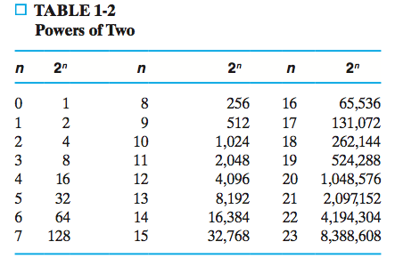
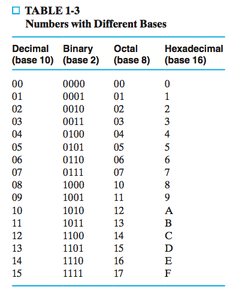
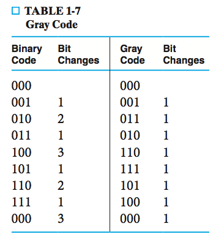

# Chapter 1 Digital Systems and Information

## 1-1 Information Representation

There are two kinds of basic signals:

* _Analog signal_
* _Digital signal_

The value of a digital signal is often determined by **ranges of voltages** rather than a single value. For example, the LOW intput signal may be the range between -0.1 and 0.1.

## 1-3 Nubmer Systems

In general, a decimal number with ndigits to the left of the decimal point and m digits to the right of the decimal point is represented by a string of coefficients:

$$
A_{n-1}A_{n-2}{\cdots}A_1A_0.A_{-1}A_{-2}{\cdots}A_{-m+1}A_{-m}
$$

**And $A_i$ correspond to $10^i$**. For example, in 736.34, 7 is in $A_2$ position, thus it corresponds to $10^2$.

**The decimal system is said to be of _base_ or _radix_ 10.**

Actually, this representation applys to number systems of any radix. In general, a number in radix r contains **r digits**, $0, 1, 2, \cdots, r-1$. A number

$$
A_{n-1}A_{n-2}{\cdots}A_1A_0.A_{-1}A_{-2}{\cdots}A_{-m+1}A_{-m}
$$

has value

$$
A_{n-1}r^{n-1} + A_{n-2}r^{n-2} + \cdots + A_1r^1 + A_0r^0 + A_{-1}r^{-1} + \cdots A_{-m}r_{-m}
$$

In general, the "." is called the _radix point_, $A_{n-1}$ is referred to as the _most significant digit (msd)_ and $A_{-m}$ is called the _least significant digit (lsd)_.

To distinguish between numbers of different bases, it is customary to enclose the coefficients in parentheses and place a subscript after the right parenthesis to indicate the base of the number. For example,

$$
{(312.4)}_ {5} = 3 \times 5^2 + 1 \times 5 + 2 + 4 \times 5^{-1} 
$$

### Binary Numbers

When calculate a binary number, it will be convenience to imagine the corresponding powers on top of the bits like 16, 8, 4, 2, 1

The binary number system is a base 2 system. The digits in a binary number are called bits.

In digital system

* K (kilo) = $2^{10}$
* M (mega) = $2^{20}$
* G (giga) = $2^{30}$
* T (tera) = $2^{40}$

This tables show powers of 2:

Converting a decimal number to binary is basically finding the coordinate of the number in radix 2. To convert $(625)_ {10}$ to binary. A very important rule is **integer part generate integer part**:

$$
625/2 = 312 \cdots 1\\
312/2 = 156 \cdots 0\\
156/2 = 78 \cdots 0\\
78/2 = 39 \cdots 0\\
39/2 = 19 \cdots 1\\
19/2 = 9 \cdots 1\\
9/2 = 4 \cdots 1\\
4/2 = 2 \cdots 0\\
2/2 = 1 \cdots 0\\
1/2 = 0 \cdots 1
$$

The result will be 1001110001

### Octal and Hexadecimal

The octal (base 8) and hexadecimal (base 16) systems are useful for representing binary quantities. **Each octal digit corresponds to three binary digits and each hexidecimal digit correspond to four binary digits.**

Table shows some converions:

Note in hexidecimal system A, B, C, D, E, F represent 10, 11, 12, 13, 14, 15 respectively.

The conversion from binary to octal is easily accomplished by partitioning the binary number into groups of three bits each, **starting from the binary point and proceeding to the left and to the right**. For example

$$
1101011.1111
$$

is grouped as

$$
001\ 101\ 011.\ 111\ 100
$$

Then change them into corresponding octals:

153.74

Similarly

$$
0010\ 1100\ 0110\ 1011.\ 1111\ 0000\ 0110 = (2C6B.F06)_ {16}
$$

And converting from octal or hexadecimal to binary is done by reversing the procedure just performed.

### Number Ranges

Because the bits in the hardware structures used for representing numbers and fixed, **the addition of leading of trailing zeros is necessary, and the range of numbers that can be represented are fixed**.

## 1-4 Arithmetic Operations

Arithmetic operations with number s in base r follow the same rules as for decimal numbers. In a base r system, if the sum is larger than $r-1$, a carry occurs. Any carry obtained in a given postion is added to the bits in the column one significant position higher.

Borrows follow the similar rules. **A borrow into a given column adds 2 to the minuend bit, or, prepends a 1 to the MINUEND DIGIT**.

For example, 0 - 1 where a 1 is borrowed, we borrow 1 from its higher digit, the subraction becomes $ 10 - 1$ with borrow 1, which is 0.

Binary multiplication is simple. However, octal and hexadecimal operations are a bit tricky.

### Addition

Adding $59F$ and $E46$ involves converting **each pair in one column into a decimal**, and then obtain the correct sum and carries in **hexadecimal**.

First, add F and 6. In decimal, this is $15 + 6 = 21$. 21 - 16 = 5, so the sum is 5 with carry 1. 

Next column is 9 + 4 with carry 1. In decimal, this is 9 + 4 + 1= 14. So the sum is E, with carry 0.

### Multiplication

Multiplying 59F and E46 also needs to be performed with decimal.

First we calculate $59F\times 6. $ $6 \times F$ is $6 \times 15 = 90$, $90 / 16 = 5 \cdots 10$. So the product is A with carry 5.

$9 \times 6$ with carry 5 is 59, and $59 / 16 = 3 \cdots 11$. So the product is B with carry 3.

$5 \times 6$ with carry 3 is 33, and $33/16 = 2 \cdots 1$. So the product is 1 with carry 2.

Thus, $6 \times 59F = 21BA$

### Conversion from Decimal to Other Bases

A octal number $A_{n-1}A_{n-2}\cdots A_1A_0$ is equal to

$$
(A_{n-1}A_{n-2}\cdots A_2A_1) * 8 + A_0
$$

You should understand that this is recursive, and $A_0$ is smaller than 8.

We can prove that $(153)_ {10} = (231)_ 8$. In

$$
153/8 = 19 \cdots 1
$$

The quotient 19 equals $A_2A_1$, which is $(23)_ 8$, and the remainder 8 equals $A_0$, which is 1.

Thus, if we repeat this, then **the sequence of remainder will be the resulting octal number**.

#### Conversion of Decimal Fractions to Binary

A octal fraction $0.A_{-1}\cdots A_{-m+1}A_{-m}$ is equal to

$$
(A_{-1} + 0.A_{-2}A_{-3}\cdots A_{-m+1}A_{-m})r^{-1}
$$

This is also recursive and $A_{-1}$ is a integer larger than 0.

We know $(0.513)_ {10} = (0.407)_ 8$

$$
0.513 \times 8 = 4 + 0.104
$$

As you may guess, 4 is $A_{-1}$ and 0.104 is $0.A_{-2}A{-3}$.

Then **the sequence of the integer parts will be the final octal number**.

## 1-5 Decimal Codes

An n-bit _binary code_ is a group of n bits that assume up to $2^n$ distance combinations of 1s and 0s, with each combination representing one element of the set being coded. **A set of k elements will need $\lceil \log{k} \rceil$ bits**.

A decimal digit will need a 4-bit binary code. The code will have come unassigned bit combinations. There many ways to represent a decimal digit, but the most common know code is called _binary-coded decimal_ or BCD.

**A number with n decimal digits will require 4n bits in BCD**. Decimal 396 is represented in BCD with 12 bits as

$$
0011\ 1001\ 0110
$$

**A BCD number greater than 10 has a representation different from its equivalent binary number**. For example

$$
(185)_ {10} = (0001\ 1000\ 0101)_ {BCD} = (10111001)_ 2
$$

**Codes are symbols**. The only difference between a decimal and a BCD number is that decimals are written with the symbols $0, 1, 2, \ldots, 9$ and BCD numbers use the binary codes $0000, 0001, 0010, \ldots, 1001$

## 1-6 Alphanumeric Codes

Many applications of digital computers require the handling of data consisting not only of numbers, but also letters. It is necessary to formulate a binary code for any alphnumeric characters as well as many special characters.

### ASCII Character Code

The standard binary code for the alphanumeric characters is called ASCII (American Standard Code for Information Interchange). It uses **seven bits** to code **128 characters**. 

The seven bits of the code are designated by **$B_1$ though $B_7$**, with $B_7$ being the most significant bit.

**Note that the most significant three bits, $B_7B_6B_5$, determine the column of the table and the least significant four bits the row of the table**. The letter A, for example, is represented in ASCII as 1000001 (**colown 100, row 0001**).

Note that **the letter are in columns between 100 and 111**. 'A' and 'a' are in row 0001.

ASCII is a 7-bit code, but most computers manipulate an 8-bit quantity as a single unit called a _byte_. Therefore, ASCII characters most often are stored one per byte, with the most significant bit set to 0. The extra bit is sometimes used for specific purposes, depending on the application.

Over the years, many different character sets were created to represent the scripts used in various languages, as well as special technical and methamatical symbols. These character sets were incompatible with each other.

Unicode was developed as an industry standard for providing a common representation of symbols and ideographs for the most of the world's languages. It covers characters from many different languages.

### Parity Bit

To **detect erros in data communication and processing**, an additional bit is sometimes added to a **binary code word** to define its **parity**. 

A _parity bit_ is the extra bit included to **make the total number of 1s in the resulting code word either even or odd.**

Note the parity bit is **aimed to change the parity of the word, not to represent it**.

The following example use an extra bit in the most significant bit of the code to produce an even number of 1s:

$$
1000001 \ \rightarrow 01000001
$$

#### Example 1-8 Error Detection and Correction for ASCII Transmission

The simplest case is handled as follows - An even (or odd) parity bit is generated at the sending end for **all** 7-bit ASCII characters. Then the parity of each character is then checked at the receiving end; if the parity of the received character is not even (odd), it means **at least** one bit has changed its value. 

**This method can only detect odd numbers of bit changes.**

## 1-7 Gray Codes

For a set of codes, we can specify an order. Then the relation "adjacency" makes sense. In gray code, the number of bits different between **adjacent codes** is 1. This is an example:

CMOS refers to Complementary Metal Oxide Semiconductor

