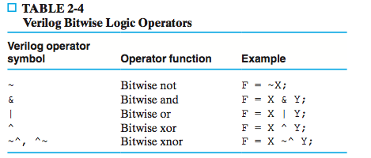

# Chapter 2 Combinational Logic Circuits

## 2-1 Binary Logic and Gates

_Digital circuits_ are hardware components that manipulate binary information.

_Logic gates_ are simple circuit. When we refer to logic gates, we are only concerned wih the external logic properties.

**Each gate corresponds to a logic function**.

The following is the **methamatical basics** of logic circuits.

## Binary Logic

Variables: {1, 0}

Basic logical operations: {AND, OR, NOT}

1. **AND**. $Z = XY$ is read "Z is equal to X AND Y".
2. **OR**. $Z = X + Y$ is read "Z is equal to X AND Y"
3. **NOT**. $Z = \bar X$ is read "Z is equal to NOT X". **The NOT operation is also referred to as the _complement_ operation**.

## Logic Gates

_Logic gates_ are electronic circuits that **operate on one or more input signals to produce an output signal**.

Changes from 1 to 0 or from 0 or 1 are called _transitions_. The intermediate regions are called the _transition regions_.

The graphics symbols used to designate the three type of gates are shown below, together with the timing diagrams for the corresponding output signal for each type of gate.:

The horizontal axis of a _timing diagram_ represents time, and the vertical axis shows a singal as its changes between the two possible voltage levels.

**NOT gate is more commonly referred to as an _inverter_**.

Each gate has another very important property called _gate delay_, the length of time it takes for an input change to result in the corresponding output change.
**The delay is about change**. We denote the gate delay with symbol $t_G$. 

**A change in the output waveform is shifted $t_G$ time units later compared to the change in input that causes it**.

The graphics symbols and truth tables of the most commonly used logic-gate types are shown in Firgure 2-3.

Note NAND and NOR gates consists of an AND symbol and an OR symbol, respectively, with a circle on the output. The small circle at the output of the graphical symbol of an inverter is formally called a _negation indicator_ and designates the logical complement.

A gate type that alone can be used to implement all possible Boolean functions is called a _universal gate_ and is said to be "functionally complete". To show that the NAND gate is a universal gate, we need only show that the logical operations of AND, OR, and NOT can be obatained with NAND gates only.

**Note the corresponding function for NAND is $F = \overline{X + Y}$.**

Two other gates are the exclusive-OR (XOR) and exclusive-NOR (XNOR) gates. The XOR gate is similar to that for the OR gate, except for the additional curved line on the inputs. The exlusive-OR ahs the special symbol $\bigoplus$ to desinate its operation.

Please draw gate AND, OR, NOT, NAND, NOR, XOR, XNOR by yourself.

### HDL Representations of Gates

HDLs are specifically oriented to describing hardware structures and behavior. They represent extensive parallel operation, whereas most programming languages represent serial operation.

**HDL provide an alternative to schematics.** A language is used in this fashion, it sis referred to as a structural description, where the language describes an **interconnection of components**. Such a structural description is also referred to as a _netlist_.

Table 2-2 shows the built-in Verilog primitives

Each primitive includes a list of signals that are its inputs and output. the first signal is the output of the gate, and the remaining sisgnals are the inputs.

Verilog also has logic operators that can be used to model the basic combinational gates

For small circuits, describing the input/output relationships with logic functions, truth tables, or schematics might be clear and feasible. But for larger, more complex circuits, DLs ar eoften more approriate.

2-2 Boolean Algebra

Boolean algebra is standard mathematical form of binary logic.

* _Boolean expression_ is an algebraic expression formed by using binary variables, the constatns 0 and 1, the logic operation symbols, and parentheses. For example, $\bar LA + B$

* _Boolean function_ can be described by a Boolean equation consisting of a binary variable identifying the function followed by an equals sign and a Boolean expression. For example,

$$
L(D, X, A) = D\bar X + A
$$

A _truth table_ can be used to represent a Boolean function. **The number of rows in a truth table is $2^n$, where n is the number of variables in the function**.

Circuit gates are interconnected by wires that carry logic signals. Logic circuits of this type are called _combinational logic circtuits_, **since the variables are "combined" by the logical operations.**

By manipulating a Boolean expression, both **the number of gates in the circuit and the numbers of inputs to the gates can be reduced**.

### Basic Identities of Boolean Algebra

Note identities 15:

$$
X + YZ = (X + Y)(X + Z)
$$

An important property of Boolean algebra is _duality_. **The _dual_ of an algebraic expression is obtained by interchanging OR and AND operations and replacing 1s by 0s and 0s by 1s.**

**Note we don't complement the variables**. If we do this, it will become the complement of the original equation.

### Algebraic Manipulation

An example

$$
F = \bar XYZ + \bar XY\bar Z = \bar XY
$$

When a Boolean equation is implemented with logic gates, **each term requires a gate**, and **each variable within the term designates an input to the gate**. We define a _literal_ as a single variable within a term that may or may not be complemented. For example, following function has three terms and eight literals:

$$
F = \bar XYZ + \bar XY\bar Z + XZ
$$

The following identities are common in the simplification of equations:

$$
1.\quad X+XY = X\\
2.\quad XY + X\bar 
Y = X\\
3.\quad X + \bar XY = X + Y
$$

And their duals:

$$
4.\quad X(X + Y) = X\\
5.\quad (X + Y)(X + \bar Y) = X\\
6.\quad X(\bar X + Y) = XY
$$

**The _duality principle_ of Boolean algebra states that a Boolean equation remains valid if we take the dual of the expressions on both sides of the equals sign**.

The following _consensus theorem_ is useful when simplifying Boolean expressions

$$
XY + \overline XZ + YZ = XY + \bar XZ
$$

There are relations between terms. $XY$ and $\bar XZ$ are disjoint, and $YZ$ is contained in the union of them.

How do you prove this? First split the term $YZ$ that is contained. Then you use "if $A \subset B, then A \cup B = A" to simplify:

$$
\bar XY + XZ + YZ = \bar XY + XZ + \bar XYZ + XYZ = \bar XY + XZ
$$

### Complement of a Function

The complement of a expression is obtained by interchanging AND and OR operations and **complementing each variable and constant**. For example

$$
F = \bar{X}Y\bar{Z} + \bar{X}\bar{Y}Z
\bar{F} = \overline{\bar{X}Y\bar{Z} + \bar{X}\bar{Y}Z} = (X + \bar{Y} + Z)(X + Y + \bar{Z})
$$

## 2-3 Standard Forms

The standard forms contain _product terms_ and _sum terms_. An example of product term is $X\bar{Y}Z$.

### Minterms and Maxterms

A truth table defines a Boolean function. The set of all Boolean function is a linear space. And minterm is the base of it:

* All minterms are disjoint.
* The sum of all minterms are T.

Given a ordering of variables, each function including minterms corresponds to exactly one n-tuple. For example:

* $AB + \bar C$ corresponds to  $(0, 1, 0, 1, 0, 1, 1, 1)$
* $A\bar{B}C$ corresponds to $(0, 0, 0, 0, 0, 1, 0, 0)$.

It is clear why minterms are called bases.

And given an ordering of the variables, symbol $m_i$ can be used to specify minterms. For example, $m_4 = A\bar{B}\bar{C}$. And $M_i$ has similar usage.

**Note the largest subscript is $2^n - 1$, not $2^n$.**.

**Note $M_0$ is $A + B + C$.**

**A very important property of minterms and maxterms is a minterm and maxterm with the same subscript are the complements of each other.**:

$$
m_i = \overline{M_i}
$$

For exmaple, $m_5 = A\bar{B}C$ and $M_5 = (\bar{A} + B + \bar{C})$.

Any Boolean funciton can be represented as a _sum of minterms_. Any function can be abbreviated as:

$$
F = \sum{m(i)}
$$

The symbol $\sum$ stands for the logical sum of the minterms. The numbers following it represent the minterms of the function.
For example, $F = \sum{m(0, 2, 5, 7)}$.

Two very important property:

If $F = \sum{m(0, 2, 5, 7)}$, then

$$
F = \prod(M(1, 3, 4, 6))
\bar{F} = \sum{m(1, 3, 4, 6)}.
$$

A function that is not in the sum-of-minterm form can be converted to that form by means of a truth table.

### Sum of Products

The sum-of-minterms form contains the maximum number of literals in each term and usually has more product terms than necessary. We need to simplify the expression. The result is a simplified expression in _sum-of-product_ form. For example, 

$$
F = \bar{Y} + \bar{X}Y\bar{Z} + XY
$$

The logic diagram for a sum-of products form consists of **a group of AND gates followed by a single OR gate**. **Each product term except for a term with a single literal requires an AND gate**. The logical sum is formed with an OR gate that has single literals and and the outputs of the AND gates as inputs.

**The AND gates followed by the OR gate form a circuit configuration referred to as a _two-level implementation_ or _two-level circuit_.**.

### Product of Sums

The gate structure of the product-of-sums expression consists of a group of OR gates for the sum terms, followed by an AND gate.

## 2-4 Two-Level Circuit Optimization

_Karnaugh map_ or _K-map_ handle optimization for two-level implementations, but do not apply directly to possible simpler implementations for the general cas e with three of more levels.

**Each square in the map represent a minterm**. And K-map show exaclty the inclusion of disjoint relations between product terms.

### Cost Criteria

The first criterion is _literal cost_, **the number of literal appearances in a Boolean exrpession.**

For example, 

$$
F = AB + C(D + E) \\
F + AB + CD + CE
$$

There are five literal appearances in the first equation, and six in the second.

Literal cost has the advantage that it is very simple to evaluate. But it's not accurate.

We define _gate-input_ cost as **the number of inputs to the gates** in the implementation corresponding exactly to the given equation or equations.

This cost can be determined easily from the logic diagram by simple counting the total number of inputs to the gates in the logical. 

Or **ONLY in sum-of-products or product-of-sums equations,** it can be found from the equation by finding the sum of 

1. All literal appearances
2. The number of terms **excluding terms that consist only of a single literal**.
3. **Optionally**, the number of distinct complemented single literals.

**Note a single literal does not count in the second counting**.

For example,

$$
G = ABCD + \overline{ABCD}\\
G = (\bar{A} + B)(\bar{B} + C)(\bar{C} + D) (\bar{D} + A)
$$

The gate input costs are respectively $8 + 2 = 10$ and $8 + 4 = 12$ without the count from three and 14 and 16 including the gate input of inverters.

Gate-input cost is propotional to the number of transistors and wires used in implementing a logic circuit. As the number increases, **literal cost represents a smaller propotion of the actual circuit cost, since more and more gatse have no inputs from outside the circuit itself.**

### Map Structures

**The nubmer of squares in each map is equal to the number of minterms in the corresponding funciton** The use of $i​$ to represent the minterm $m_i​$ is carried over to the cells of the maps, each of which correpsonds to a minterm.

Each map is labelled in two ways:

1. with variables at the upper left for the columns and the rows and with a binary combination of those variables for each column and row. For example, $00, 01$$.
2. with single variable labels at the edges of the map applied by a bracket to a single or double rows and columns.

Only one of these two schemes is required.

**The binary combinations across the top and down the left side of a map take the form of a Gray code**. This represents the **adjacency** of binary combinations. 

1. Two product terms are _adjacent_ if they differ in one and only one literal.
2. Adjacent terms can be combined.

## 2-5 Map Manipulation

### Essential Prime Implicants

_Implicants_ are rectangles made up of $2^m$ squares.

_Prime implicants_ are _implicants_ that are not included in another implicant. Or the largest possible implicant.

_Essential prime implicants_ are prime implicants that has at least one square that is not included in another prime implicant.

The procedure for finding the optimized expression include two steps

1. Find all essential prime implicants
2. Other prime implicants needed to include the remaining minterms.

### Selection Rule

We choose prime implicants one by one. The prime implicant we choose at each stage should **result in the least overlaps**.

### Product-of-Sums Optimization

1. Marked all maxterms in K-map.

2. Combine squares.

   Note in K-map for maxterms, combination of $1$ and 0 doesn't change. However,  squares used to represent $A$ is now used to represent $\bar A$.

We've say that **a Boolean function can be completely described with a K-map**. However, a square can either represent a minterm or maxterm. Based on the value on each square, either the minterm of maxterm is included.

**The minterm and maxterm represented in the same square are complements of each other**.

### Don't-Care Conditions

Don't-care condictions are outputs of particular inputs that we don't care. They represented by a "X" in the truth table and K-map.

Don't care condictions result in _incompletely specified function_. Thus the K-map with only $0$s and $1$s to represent it is not unique. 

The procedure:

* Find all prime implicants.
* Expand the prime implicants with don't care conditions if possible. One original implicant may generated multiple expanded implicants.
* Do standard simplification.

## 2-6 Exclusive-Or Operator and Gates

The XOR operation
$$
X\oplus Y = X\bar{Y} + \bar{X}Y
$$
The NXOR operation
$$
\overline{X\oplus Y} = XY + \bar{X}\bar{Y}
$$
**The exclusive-NOR is also known as _equivalence_**.

Note XOR is both commutative and associative. So
$$
A\oplus B\oplus C
$$
makes good sense.

### Odd Functions

Note 
$$
X\oplus Y\oplus Z = X\bar{Y}\bar{Z} + \bar{X}Y\bar{Z} + \bar{X}\bar{Y}Z
$$
That means this expression takes $1$ **only when the nubmer of $1$s in the input is odd**. This is called _odd function_.

The K-map for this function is like:

Note every pair of minterms are not adjacent. These minterms are said to be _distance two_ from each other.

This tells us that **if we need an odd function, we can use XOR gates to implement it**.

The _even function_ is similar.

## 2-7 Gate Propagation Delay

Propagation delay if the time require for a **change** in the input to be seen in the output.

Three propagation delay:

* The _high-to-low propagation time_ $t_{PHL}$.
* The _low-to-high propagation time_ $t_{PLH}$.
* _Progagation delay_ $t_{pd}$. This is the **maximum of these two delays**.

We often measure the time of a voltage change from the **reference voltage**. For example a 50 percent point.

There are two different delay models:

1. transport delay
2. inertial delay

In _transport delay_ model, there is nothing strange. In _inertial delay_ model, some _edges_ may be igonored. If **two ajacent edge in ND (no delay) output happens within the _rejection time_ , this pair of edges will be ignored in the ID (inertial delay) output**. The _rejection time_ is no larger than the propagation delay and is often equal to the propagation delay.

In ID models, edges cancel **in pair**. The pair occurs first cancel first.

An _edge_ is a change in a waveform, that is, a change in the signal of the waveform. 

The actual delay of a gates has two sources:

1. The fixed inherent delay itself
2. The actual fan-out of the gate, **in terms of standard loads**.

Thus a formula for the actual delay of a gate would be like
$$
t_{pd} = F + aSL
$$
Where $F$ represents the fixed delay of the gate, $SL$ represent the standard load of the output, $a$ is delay per standear load. See Example 2-15.

## 2-8 Multiple Level Circuit Optimization

Before introducing the transformations used in multiple level circuit optimization, we review the method to find the gate input cost of **ANY** set of functions. **Note that this definition also gives a tree structure of the equations.**

* The total gate input is the sum of the gate input of each equation

* For each function, it can either can be decomposed as 

  * A sum of subfunction
  * A product of subfunction

  But **not a mixture of them**. Then **the gate input of this function is the number of sum/product terms plus the gate-input of each of the subfunctions.**

* The gate-input for a single variable is 0.

If the inverter input cost is also included, then the gate input will be that of above calculated number plus **the number of DIFFERENT variable complemented. **

For example, the following function set
$$
G = A\bar{X_1}X_2 + BX_1\bar{X_2}\\
X_1 = CD\\
X_2 = E+F
$$
The gate input for $G$ is (in the order of hierarchy) (without inverters)
$$
2 + 3 + 3 = 8
$$
The last two is for the complement of $X_1$ and $X_2$. Note that if there are two $\bar{X_1}$, we only count once.

And the gate input costs for the last two is $2 + 2 = 4$. So totally $12$.

For
$$
G = A(\bar{C} + \bar{D})(E + F) + BCD\bar{E}{\bar{F}}
$$
The gate input cost is $14$ without inverters. **Note when spliting subfunctions, we don't make a mix of sum and product.**

The tranformations for multiple-level optimization are

1. _Factoring_: algebraic factoring
2. _Decompostion_: decompose one function into a set of functions
3. _Extraction_: express multiple functions as a set of new functions
4. _Substitution_: substitue a function for some expressions in another function

Factoring works because the number of the appearance will difinitely decrease. 

Decomposition is actually splitting out subfunctions. This works when **common subfunctions are factored as one**.

Extraction is sharing subfunctions between **different** functions.

Substitution actually does nothing.

An example of this is on P82.

So the general procedure:

1. Algebraic factoring for each function
2. Decompose  each function
3. Extract common subfunction

## 2-9 Other Gate Types

