# Chapter 3 Combinational Logic Design

## 3-1 Design Procedures

The procedures involves the following steps. **What should be given at each step is specified.**

1. **Specification:** A verbal description. The results should include

   * Inputs and their names, like $A, B, C, D$
   * Outputs and their names, like $a, b, \ldots g$
   * The relationships between inputs and outputs

   Right after you identify the inputs and outputs, you should conceptually put them in the input and output columns of a truth table and consider the values in the truth table.

2. **Formulation:** Derive the truth table or initial Boolean equations that define the required relationships between inputs and outputs. The results should include

   * Preferably a truth table, possibly with don't care condictions
   * Or a set of Boolean equations

3. **Optimization:** Apply two-level optimization using K-maps and multiple optimization using factoring, decomposition and extraction. Then draw a logic diagram or provide a netlist for the resulting circuits. The results should include

   * Two-level optimization: K-maps for each output, and a set of initial two-level-optimized equations

   * Multiple-level optimization: 

     * Factoring for each equation (optional)
     * Decomposition for each equation (optional)
     * Extract common subexpression

     The result should be a new set of expresssions.

   * A logic diagram or netlist for the resulting equation set.

4. **Technology mapping:** Transform the diagram or netlist to a new diagram or netlist using available technology. The result is a new diagram of netlist

5. **Verification**: Verify the correctness of the final design.

Three examples are given to illustrate the design procedure:

* BCD-to-Excess-3 Code Converter
* BCD-to-Seven-Segment Decoder
* 4-bit Equality Comparator

The first two are known as _code converters_ in that they tranlate information from one binary code to another.

Note how in these examples the design procedure is illustrated. Nothe how they specify **what's the inputs and outputs**, the relationships between inputs and outputs, the names of them and how they handle don't care conditions.

## 3-2 Beginning Hierarchical Design

The design of a large system is often _hierachical_. Then the design procedure is:

* Find a hierarchy of the system, in terms of _blocks_.
* Design the blocks using the procedure above.

Some ideas:

* Primitives blocks: AND, OR, inverter, NOT

* Predefined blocks: blocks that is predefined, including primitive blocks

  **Predefined blocks have a symbol, but no logic schematics.**

* Blocks: basic concept of hierarchy

  ****

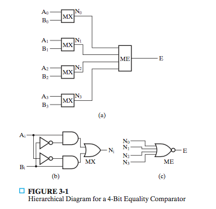

This is a example of the hierarchical design diagram for a 4-bit equality comparator. **Each level of the hierarchy is contructed using blocks**. Each blocks that appear should be descibed in lower levels.

Note when drawing the block, we **give the name of the block rather than its instant name**. For example, we specify name "AND" but not "and1".

The structure of the hierarchy can be represented using a tree. In a hierarchy tree, **the leaves are predefined blocks**.

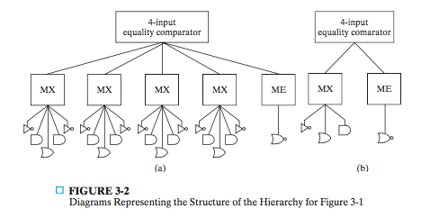

Note here we also only give the block names. And in the tree on the right, **we keep only one copy of each distanct block shown.**

Three properties:

1. A hierarchy reduces the complexity required to represent the schematic disgram.

2. Every hierarchy ends at a set of "leaves", the predefined blocks.

3. The _reuse_ of blocks. **The effect is that you will need to draw less blocks in your schematics than needed if you draw it without hierarchy**.The appearance of a block **within another design** is called an _instance_ of the block, and its use is called an _instantiation_.  **For a given repeated block, only one design is necessary**. However, separate hardware has to be provided for each instance of the block.

   Note **the reuse of blocks is only confined to the schematics that need to be designed, not the actual hardware implementation**. 

   _Regularity_ is the ratio of primitives in the final circuit to the total number of blocks in a hierarchical diagram. Or more intuitively, the ratio of **the complexity of design** to **the complexity of implementation**. The regularity of this hierarchy is $21/11$.

The textbook illustrate the design procedure for a 4-bit Equality Comparator. The specificaton as usual, specify the inputs and outputs, and their relationships. However in formulation, **a truth table is avoided because of its size**. Instead, it gives **a hierarchy.** That is, it specifies a logic diagram with blocks instead of primitives:

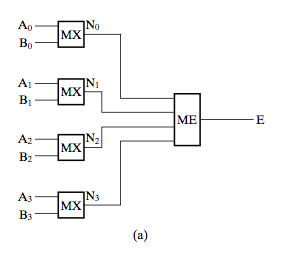

Generally, the logic diagram for hierarchy can contain multiple levels. In formulation, we gives the logic diagram for each level, and **only specify the truth table for blocks that cannot be divided, or predefined blocks**. In this example, these blocks are $MX$ and $ME$.

And in optimization, **we only deals with the design of the predefined blocks**, then then give the circuit for this predefined blocks. The final result will consist of

* The logic diagram for each level of hierarchy
* The logic diagram for predefined blocks in terms of primitives

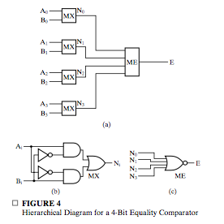

In this chapter we talks about _functional blocks_, which are predefined blocks that are often used.

## 3-2 Technology Mapping

Recall that technology mapping is actually **converting one logic diagram or netlist to another logic diagram or netlist using avaible implementation technology.** Thus, we generally start with an optimized logic circuit.

Given an optimized circuit that consists of AND gates, OR gates and inverters, the following procedure produces a circuit using NAND (or NOR) gates with unrestricted fan-in:

1. Replace each AND and OR gate with the equivalent combination of NAND gate and inverters.
2. Cancel all inverter pairs
3. Push all inverters between either a circuit input or a driving NAND gate output and the driven NAND gate input toward the driven NAND gate input.
4. Cancel all inverter pairs.
5. Push back all inverters, if possible. Go to 3

The step 3, 4, 5 seems unnecessary. However, they are necessary, that is because the configuration

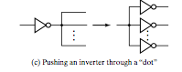

is not equivalent until we perform 3. That is, in the left circuit, if there is a inverter on the driven lines, the driving inverter and driven inverter cannot cancel.

Actually, "push" and "push back" **only deals with this case.**

## 3-4 Verification

In manual logic analysis, we

* Find the Boolean equations from the circuit
* Expand the Boolean equations into sum-of-product form
* Derived the truth table for the equations.

Finding Boolean equations from a circuit may require introducing some intermediate variables.

Or we can use computer simulation instead.

## 3-5 Combinational Functional Blocks

Specific combinational functions and combinational circuits are common in digital design, and we defined them as _functional blocks_. So in essence, **what we do is to give names to some functions and functional blocks**.

This names correspond to real-world concepts, like enabling a function, choosing a function, setting a value and so on.

## 3-6 Rudimentary Logic Functions

### Value-Fixing, Transferring, and Inverting

**A rudimentary logic function is a function of only one Boolean variable.**

From the definition, we expect that there are almost for types of functions for a single variable.

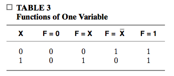

The first and the last are called **value fixing** because it assigns either constant 0 or 1 to the function. The second is **transfering** and the third is called **inverting**.

The implementation of these is extremely simple.

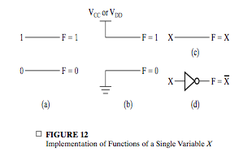

### Multipe-Bit Functions

**A multiple-bit rudimentary logic function is a collection of rudimentary logic functions. ** It's function for **vector variables**.

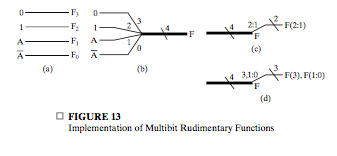

### Enabling

An enabling function has two inputs IN and EN, and one output OUT.

When EN is 1, IN is "allow" to reach OUT. And when EN is 0, the path is blocked, and OUT is set to a fixed value, such as 0.

Enabling can easily be implemented with an AND gate or OR gate, depending on how you define the behavior of the gates.

## 3-7 Decoding

_Decoding_ is the conversion of an $n$-bit input code to an $m$-bit output code with $n \leq m \leq 2^n$. Note in general decoding, the $m$ bits doesn't have to be in $(0, 0, \cdots, 0, 0)$ form, but if $2^n$ these forms are avalable, all possible codes can be represented.

The functional blocks that implement decoding are called **n-to-m-line decoders.**

Typically, in a decoder, the inputs are named $(A_{n-1}, A_{n-2}, \ldots, A_0)$, and output  $(D_{m-1}, D_{m-2}, \ldots, D_0).$ The formal definition is

> $$
> D_i(A_{n-1}, A_{n-2}, \ldots, A_0) = m_i, \quad i = 1, 2, \ldots, m-1.
> $$
>

And it's denoted by
$$
D[m - 1, 0] = Dec(A[n - 1, 0])
$$

This means that **$D_i = 1$ only when $(A_n, A_{n-1},\ldots, A_0) = i$**.

This outputs are **actually minterms.**
$$
D_i(A_{n-1}, A_{n-2},\ldots, A_0) = m_i
$$
Thus you can expect that by combining the outputs with OR gate, you can obtain any functions.

Because these outputs are actually minterms, we can easily implement a n-to-m-line decoder with $2^n$ AND gates with $n$ inputs each. The gate input cost will be great. Thus we usually design this hierarchically. 

In general a n-to-$2^n$-line decoder can be implemented with 

* An a-to-$2^a$-line decoder
* An b-to-$2^b$-line decoder
* $2^n$ AND gates with two inputs each.

To draw this decoder, we place inputs and outputs $A_i$ and $D_j$ in either both decreasing or increasing order of $i$ and $j$. That determines where the complement and the variable itself should be placed.

Then we places the $2^n$ AND on the outputs. Then **we devide the AND gates into $b$ parts, each with $a$ AND gates.** Then

* Connect the $2^a$ outputs each to $a$ AND.
* Connect the $2^b$ outputs each to $b$ AND.

This is like modulo congruence.

#### Decoder and Enabling Combinations

This is implemented by **attaching $m$ enabling circuits to the decoder outputs.**

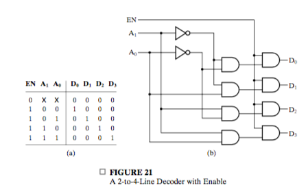

This is actually an implementation of _distribution_, which is the inverse of _selection_. A circuit implementing distribution is called a _demultiplexer_. In such a circuit, **we conceptually divide the inputs and outputs as:**

* $1$ data input
* $2^n$ data outputs
* A control inputs

#### Decoder-Based Combinational Circuits

A $n$-to-$2^n$-line decoder can used to implement any Boolean function with $n$ inputs. **Note the decoder we choose is based on the number of the inputs to the funtion, not its outpus.**

This can be achieved by using a OR gate to form the logic sum of the minterms.

If the number of minterms in a function is greater than $2^n/2$, then the complement of $F$, $\bar F$ can be expressed with fewer minterms. **In this case, a NOR gate is useful.**

For example, this can be used to implement a $1$-bit binary adder.

## 3-8 Encoding

An encoder has $2^n$ input lines $(D_{m-1}, D_{m-2}, \ldots, D_0)$and $n$ output lines $(A_{n-1}, A_{n-2}, \ldots, A_0)$. The defintion is:

> If $D_i = 1$, $(A_{n-1}, A_{n-2}, \ldots, A_0)$ = i.

For example, for a $4$-to-$2$-line encoder, if the inputs are
$$
(1,0,0,0)
$$
Becase $D_3 = 1$, the outputs will be 
$$
(1, 1)
$$
To design an encoder, you can simply use the truth table of a decoder like

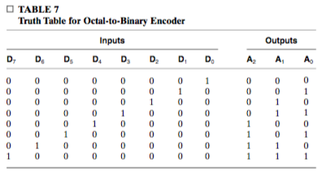

Or, in designing a encoder, we note the following fact:

> For all three-bit binary number, there are only a few that has a $1$ on there second significant bit, like $010$, $111$.

That means if $A_i = 1$, then in $D_j$, $j$ has has $1$ on its $i$th bit. For example, in a $8$-to-$3$-line encoder, if $A_2 = 1$, the inputs can be $D_{100}, D_{101}, D_{110}, D_{111}$, or $D_4, D_5, D_6, D_7$. That means
$$
A_2 = D_4 + D_5 + D_6 + D_7
$$
And you can find the following
$$
A_0 = D_1 + D_3 + D_5+ D_7\\
A_1 = D_2 + D_3 + D_6 + D_7\\
$$
Thus an encoder can be implemented with three $4$-input OR gates.

### Priority Encoder

There are two situations undefined in the above-mentioned encoder

* There are two ones in the inputs.
* There are no ones in the inputs.

The first problem is solved using priority encoder, and the second is solved by introducing a "valid" output V:

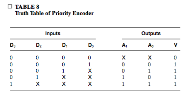

This is a _condensed truth table_. The X's in output columns are don't-care conditions, **the X's in input columns are product terms that are not minterms.**

**The number of rows of a full truth table represented in a row in the condensed table is $2^p$, where $p$ is the number of X's in the row.**

**Note that this truth table can be converted into a K-map easily.**

The resulting Boolean equations are 
$$
\begin {align}
A_0& = D_3 + D_1\bar{D_2}\\
A_1& = D_2 + D_3\\
V &= D_0 + D_1 + D_2 + D_3
\end {align}
$$

## 3-9 Selecting 

### Multiplexer

The I/O of a **$m$-to-$1$-line multiplexer** are

* _selection inputs_, $S[n - 1, 0]$
* information inputs, $I_{m-1}, I_{m -2}, \ldots, I_{0}$
* output, $O$

Thus we choose one information from the $2^n$ information. A multiplexer is often abbreviated as MUX.

Generally, we can implement a $m$-to-$1$-line multiplexer usinig 

- An n-to-m-line decoder
- An $m\times2$ AND-OR 

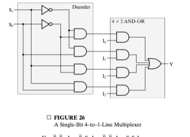

In multiplexer, we have another notation of the truth table.

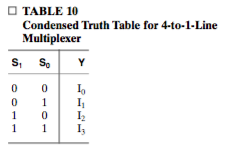

Note the second notation is **complete**. Each row in the condensed truth table correspond to $2$ rows in a full truth table.

**It's interesing to note that any truth table can be written in this form, by introducing information inputs $I[m - 1, 0]$, using value fixing. **

### Expansion

Instead of choosing from $m$ single value, we may choose from $m$ vectors, each with $p$ bits.

In this case

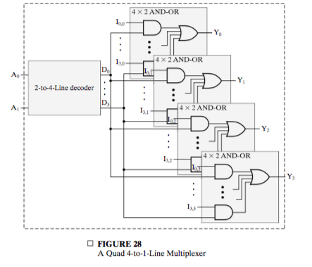

### Multiplexer-Based Combinational Circuits

Recall that the condensed truth table for a multiplexer is like

By fixing the value of $I_i$, you can implement any function. Generally in this implementation, a $n$ variable function requires $n$ selection inputs. **In this implementation, each information input represent a minterm.**

A more efficient method implements a Boolean function of $n$ variables with a multiplexer that has only $n - 1$ selection inputs, **with four rudimentary functions.** For example, a $1$-bit binary adder can be implemented as

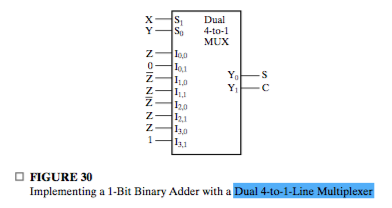

Consider the truth table for this multiplexer, which has two output columns, each of which implements a Boolean function. Then you can do the implementation.

