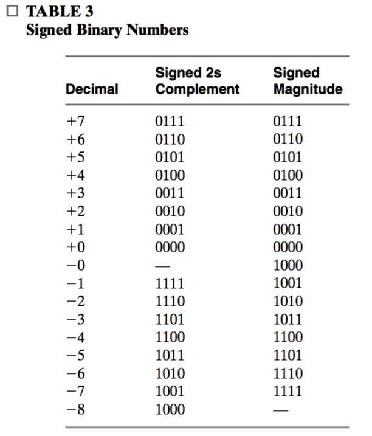
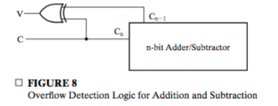

# Chapter 4: Arithmetic Functions and HDLs

Arithmetic blocks are functional block that perform arithmetic operations.

## 4-1 Iterative Combinational Circuits

There is an special **hierarchical circtuit** called **iterative array**. It performs a function that requires many same subfunctions. The subfunction blocks are referred to as **cells** and the overall implementation is called an **array of cells.** 

There will often be **connnections between adjacent cells** to pass values.

Arithmetic blocks are typically design to operate on **binary input vectors and produce binary output vectors.** That means the same subfunction can be applied to each bit position, with connections passing value between adjacent bit positions.

Generally, an iterative array that operates one two $n$-input vectors and produces an $n$-output vector is as following:

Note how this inputs and outputs are indexed. **These are indexed according to the first cell**. For example, $C_0$ are indexed $0$ but $X_1, Y_1$ are indexed $1$.

## 4-2 Binary Adders

* A **half adder** is combinational circuit that performs the addition of **two bits**.
  * Inputs: $X$, $Y$
  * Outpus: $C$, $S$
* A **full adder** is performs the addition of **three bits**
  * Inputs: $X, Y, Z$
  * Outputs: $C, S$.

The names of the circuits stem from the fact that **two half adders can be imployed to implement a full adder**.

### Half Adder (HA)

A half adder generates the **arithmetic sum** of **two bits**. The inputs and outputs are $X, Y, C, S$. This is based on:
$$
0 + 0 = 0\\
0 + 1 = 1\\
1 + 0 = 1\\
1 + 1 = 11
$$
Note only the last one generates a carry. It can be implemented with an **exclusive OR** and a **AND** gate.
$$
S = X \oplus Y\\
C = XY
$$

### Full Adder (FA)

A full adder is a combinational circuit that performs the **arithmetic sum of three input bits.** Inputs and outputs are $X, Y, Z, C, S$, where $Z$ represents **the carry from the previous lower significant position**.

Note that the function for $S$ is an **odd function**. And $C = 1$ if and only if **two or more input bits are $1$.**
$$
S = X\oplus Y \oplus Z\\
C = XY + Z(X\oplus Y)
$$
Note the equation for $C$ means: $X$ are $Y$ are both $1$, otherwise one of them is one and $Z$ is one.

**What it actually does is**:

* Find the sum and carry $S_0, C_0$of $X$ and $Y$
* Find the sum and carry $S_1, C_1$ of $S_0$ and $Z$
* The final sum is $S_1$, the final carry is $C_0 + C_1$.

It's amazing that the logic diagram follows from these equations are exactly **two half adder plus an OR gate.** 

To draw this, first draw two half adders, and then connect the right line.

If we introduce two intermediate variable $P, G$, the equations can be reformulated as
$$
\begin {align}
P &= X\oplus Y\\
G &= X Y\\
\\
S &= P \oplus Z\\
C &= PZ + G
\end {align}
$$
**Now you can better understand why a full adder can be constructed with two half adder plus a OR gate.**

In actually use, equations
$$
S_i = A_i \oplus B_i \oplus C_i\\
C_{i + 1} = C_iP_i + G_i = C_i(A_i\oplus B_i) + A_iB_i
$$
are more generally used.

### Binary Ripple Carry Adder

An **$n$-bit parallel binary adder**, or an **$n$-bit ripple carry adder**, consists of **EXACTLY** $n$ full adders, with **each output carry connected to the input carry of the next-higher-order full adder**.

* Inputs: $A[n-1, 0], B[n-1, 0], C_0$
* Outpus: $S[n -1, 0], C_n$

Note how each inputs and outputs are indexed.

### Carry-Lookahead Adder (CLA)

One problem with this ripple carry adder is that, **to find $C_{i + 1}$ you have to find $C_{i}$**, thus it will take a long time for carries to "propagate". 

To introduce carry-lookahead adder, we first introduce  the concept of **generating** and **propagating** carries. Here comes the definition.

>  The addition of two 1-digit inputs $A$ and $B$ is said to **generate** if the addition will always carry.

In the case of binary addition, $A, B$ generate if and only if $A$ and $B$ are both $1$. That is
$$
G(A, B) = A\cdot B
$$

> The addition of two 1-digit inputs $A$ and $B$ is said to **propagate** if the addition will carry whenever there is an input carry.

In the case of binary addtion, $A, B$ propagates if and only if either of them is $1$. That is we can define the propagate bit of an addition
$$
P(A, B) = A \oplus B
$$
Let $C_{i + 1}$ be the output carry, then
$$
C_{i + 1} = G_i + P_iC_i
$$
Note **now we derived the recursive definition of $C_i$.** In the case of a ripple carry adder, **we implement this recursively**. However in a carry-lookahead adder, we implement this iteratively. That is **we expand the recursion relation** as:
$$
\begin {align}
C_1 &= G_0 + P_0C_0\\
C_2 &= G_1 + G_0P_1 + C_0P_0P_1\\
C_3 &= G_2 + G_1P_2 + G_0P_1P_2 + C_0P_0P_1P_2\\
\ldots
\end {align}
$$
You can understand these equations like this: $C_{i + 1}$ can be due to $G_{i}$ to $G_0$ and $C_0$ ($G_{-1}$). For $G_n$ to reach $C_{i +1}$, $P_{i}$ to $P_{n + 1}$ are needed.

**Note that since $G_i$ and $P_i$ depend only one $A_i$ and $B_i$ but not $C_i$, the propagation delay is dramatically reduced**.

#### Implementation

The basic units for a carry-lookahead adder are **partial full adders (PFA)**.

* Inputs: $A, B, C$
* Outputs: $S, P, G$

#### Expansion

If you have four $4$-bit CLA, you may want to build a $16$-bit CLA from them. Here comes the concept of **group propagate (GP)** and **group generate (GG)**. In a 4-bit CLA,
$$
\begin {align}
&GP = P_3P_2P_1P_0\\
&GG = G_3 + G_2P_3 + G_1P_3P_2 + G_0P_3P_2P_1
\end {align}
$$
Then
$$
C_4 = GG_{3, 0} + GP_{3, 0}C_0
$$
We have said that, $C_{i + 1}$ can be due to $G_{i}$ to $G_0$ and $C_0$ ($G_{-1}$). For $G_n$ to reach $C_{i +1}$, $P_{i}$ to $P_{n + 1}$ are needed. Now

* $G_{3, 0} = 1$ means $C_4$ is due to one or more of $G_3$ to $G_0$
* $P_{3, 0} = 1$ means $C_0$ can reach $C_4$.

The hierarchy is like

 ### Something to Say

**You should realize that the above discussion has define a strict addition on the set of $n$-bit binary number.**  Note this set plus this operation has the followin property:

* Associativity
* There exists $0$ element.
* For any element $a$, there is a element $b$ such that $a$ plus $b$ equals $0$. The is the $2$'s complement

This is a strict definition for a group.

Although there are still something to say, you can be assured that **signed subtraction can be perfectly performed using addition and complements, if we choose the 2's complement system.** 

## 4-3 Binary Subtraction

Subtraction of **unsigned binary numbers has two inputs and two outputs.**

* Minuend: $M$
* Subtrahend: $N$
* Magnitude of the difference: $D$
* Sign

**If minus sign is needed in the final result, it must be stored separately from the $n$-bit result.**

The most important thing is to find the magnitude. An inefficient method is to compare the subtrahend and the minuend. An alternative is:

1. Subtruct $N$ from $M$
2. If no **end borrow occurs**, then $M \geq N$, the result is **positive** and correct.
3. If an **end borrow occurs**, then $M < N$. **Take the 2's complement of the result.** 

In this case that there's borrow into the most significant bit, the result is $M - N + 2^n$, and should subtruce from $2^n$ to get $N - M$, with a minus sign.

Subtraction of a binary number from $2^n$ is called **taking the 2's complement of the number**.

Now an adder-subtractor can be built as

### Complements

The basic idea is:

> Subtracting a number is equivalent to adding the $2$'s complement of it.

Then modification is made if necessary.

In a **base-$r$ system**, there are two types of complement:

- The _radix complement_: **r's complement**
- The _diminished radix complement: **(r - 1)'s complement**

**Given a number $N$ of $n$ digits,**

$(r - 1)$'s complement is
$$
(2^n - 1) - N
$$
$r$'s complement is
$$
2^n - N
$$
The $(r-1)$'s complement is basicly subtracing each digit from $2^n$. 

**$r$'s complement of $N$ can be obtained by adding $1$ to $(r-1)$'s complement of $N$**. Now the two complement can be represented as
$$
\bar{N}\\
\bar{N} + 1
$$
**This is more concise and easier to remember and perform**.

The $2$'s complement can also be formed by leaving all least significant $0$'s and the first $1$ unchanged and the replacing $1$s with $0$s and $0$s with $1$s in all other higher significant bits.

### Subtraction Using $2$s Complement

Note in previous method for implementing an adder-subtractor, we need

* An adder
* An subtractor
* A $2$'s complementer

In this implementation, we need

* An adder
* Two $2$'s complementers

**In essence, we perform**
$$
2^n + (M - N)
$$
And note this is equal to 
$$
M + (2^n - N)
$$

Thus the procedure is

1. Add the $2$'s complement of **the subtrahend $N$** to the minuend $M$. This performs $M + (2^n - N) = M - N + 2^n$.
2. If $M \ge N$, the sum produces an **end carry**. Dicard the carry.
3. If $M < N$, the sum does not produce an end carry. Then **Take the $2$'s complement of the sum** and placing a minus sign in front.

**A better understand is that we perform**
$$
M + \bar{N} + 1
$$
And then by looking at the end carry we decide whether take the complement of this

### 4-4 Binary Adder-Subtractors

Some facts:

* Selective $1$'s complement can be easily implemented with **XOR gates** with selection inputs.
* $M$ plus the $2$'s complement of $N$ equals $M + 1$ plus $1$'s complement of  $N$.

Now here comes the new adder-subtractor, (without the final correction)

**The amazing part is, we ingeniously make use the originally unused input carry, and connect it with the selective input.**

**The correction operation is performed by using either the adder-subtractor a second time with $M = 0$ or a selective complementer.**

### Signed Binary Numbers

There are two kinds of system for representing negative numbers:

* **Signed-magnitude system**
* **Signed-Complement system**

They have something in common:

* Both have a **sign bit** in the most significant bit with $0$ as $+$ , $1$ as $-$ . Following bits determined it's magnitude, **in different **
* They have the **same positive number representations**.
* Any negative number is obtained **from it's corresponding positive number** by some rule.

Before we start the discussion, let's see how we  can interpret a four-bit string like $1010$.

In unsiged system, **all four bits determine its magntitude**, which is $10$. 

In signed system, **the first bit is interpreted as its sign**, which is $-$. The following three bits determine its magnitude, **but in different ways.**

#### Signed-Magnitude System

Any negative number is obtained by changing the most significant bit of its positive number from $0$ to $1$.

Thus the struture is:

_$1$ sign bit + $(n-1)$ magnitude bits_

#### Signed-Magnitude System

Any negative number is obtained by taking its positive number's $2$'s complement. This is equivalent to

* Changing the sign bit to $1$
* Taking the complement of the following $n - 1$ bits.

Note that there are some twists. This is due to the **$2$'s complements for $0$ and $2^n$**.

The _signed-complement_ system prevails in actual use.

#### Signed-Binary Addition and Subtraction

In signed-magitude case, it involves regular comparison and subtraction. The rule for adding numbers in the signed $2$'s complement system does not require comparison or subtraction, **but only addition**.

> The addition of two signed binary numbers with negative numbers represented in signed $2$'s complement form is obtained from the addition of the two numbers, including their sign bits. A carry out of the sign bit position is discarded.

The subtraction can be stated as follows:

> Take the 2's complement of the subtrahend and add it to the minuend. A carry out of the sign bit position is discarded.

**It is worth noting that binary numbers in the signed-complement system are added and subtracted by the same basic addition and subtraction rules as are unsigned numbers.**

Therefore, computers need only one common hardware circuit to handle both types of arithmetic. **The only difference is the correction step is not needed in signed number addition and subtraction.**

### Overflow

Overflow may occur in and only in three cases:

* Addition of two unsigned number

  In this case, an overflow occurs **if there is an end carry.**

* Addition of two signed numbers of **the same sign**. 

  In this case, an overflow occurs if **the end carry and the most significant bit carry are different.** This can be detected using a XOR gate.

In the case of signed number subtraction, it's converted to signed number addition, then the second case applies.

Note that this adder-subtractor doesn't **include correction function**. 

In the case of a signed number operation, $C$ is not important in any sense. We only look at $V$. $V = 1$ always implies that an overflow has occurred.

In the case of an unsigned number addition, $V$ is not important in any sense and we only look at $C$.  $C = 1$ implies an overflow; if the operation is subtraction (no overflow can occur), $C = 1$ implies a correction step is needed.

Please refer to P174 in the textbook.

## 4-5 Other Arithmetic Functions

### Contraction

Value fixing, transferring, and inverting on inputs can be combined with function blocks to implement new functions. For example:

* Incrementing
* Decrementing
* Multiplication by constants
* Division by constants
* Zero fill and extension

**Very often, the combined circuit can be contracted, or simplified.**

When there is X's on outputs, there can also be a contraction.

Contraction can be applied to both equations and circuits.

### Incrementing

A $n$-bit _incrementer_ performs $A + 1$ and can be obtained by using a binary **ripple carry** adder with $B = 00..0$ and $C_0 = 1$. **Since $B$ is constant, you can expect that the resulting circuit can be simplified.** By substuting  $0$ for $B$ and $1$ for $C_0$ in the **equations**, you can contract them.
$$
S_i = A_i \oplus C_i\\
C_{i + 1} = A_iC_i
$$
To design the circuit, you must **design one single cell first**, which only contains a OR gate and AND gate. The inputs to this cell are $A_i$ and $C_i$, and the outputs are $S_i$ and $C_{i + 1}$.

In the case of incrementing, the end carry is not needed and can be marked to be X. **This means that some gates are not needed.**

For any equations, outputs are necessary, and what appears on the right of the outputs are necessary, including intermidiate variables. **But the equation for X can be removed.**

### Decrementing

This can be implemented with a adder-subtractor and contraction. However, the more straight forward way of design is using a ripple carry adder, setting $B = 11\ldots 1$ and $C_0 = 0$. Then the equations are simplified as
$$
S_i = \overline{A_i\oplus C_i}\\
C_{i + 1} = A_i + C_i
$$
You should verify that this actually the **dual** of the equations for an incrementor.

### Multiplication by Constants

First consider multiplication by powers of $2$. In this case, this is simple a  combination of 

* Transfers
* Value fixing

And the formal name is **left shift by i bit positions with zero fill**. Zero fill refers to the addition of 0s to the right of an operand.

Any constants can be represented as a sum of power of $2$. In this case, the multiplication will be a combination of 

* left shift with zero fill
* addition.

### Devision by Constants

This is similar. After the shift, the remaining bits are the quotients, and the bits discarded ar the remainders.

### Zero Fill and Extension

There are two kinds of zero fill:

* zero-fill on the right
* zero-fill on the right.

In constrast to zero fill, **sign extension** is used to increase the number of bits in an operand represented by using a complement representation for signed numbers. **If the number is negative, it should be extended with $1$ s.**

