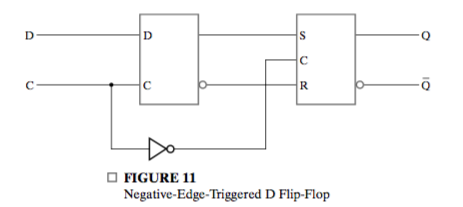
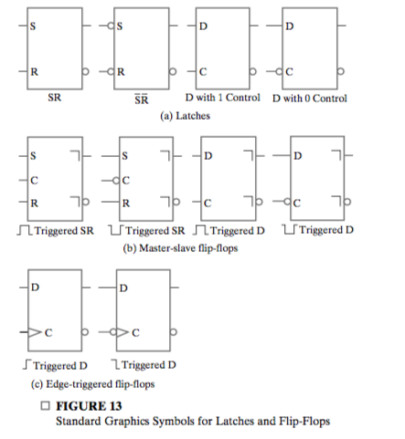
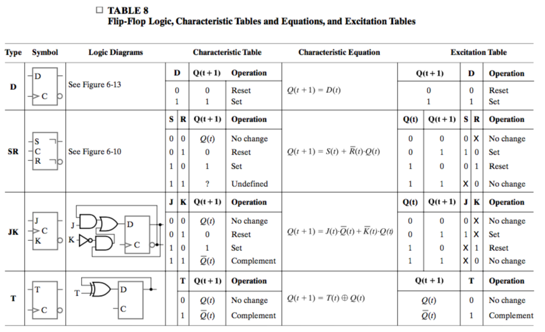

# Chapter 5: Sequential Circuits

## 5-1 Sequential Circuit Definitions

_State_ is the binary information stored in _storage elements_

**Both the next state and the output are a function of the inputs and the present state.**

Two classifications:

* _synchronous sequential circuit_
* _asynchronous sequential circuit_

Synchrounous receives input signals at discrete instants of time.

A closed loop of buffer, or two inverters **with gate delay** $t_G$ can be used to store information. In this case, the duration should be longer than $t_G$. **There must be no inversion of signal over a full loop**.

Synchronon sequanetial circuits that use **clock pulses** generated by a **clock generator** are called **clocked sequential circuits**.

A flip-flop is a binary storage device capable of storing one bit of information. The transition of outputs and state can only change at fixed time intervals.

A flip-flop has one or two inputs. one for the normal value and an optional one for the complemented value.

## 5-2 Latches

The major differences among the various types of latches and flip-flops are 

* The number of inputs they possess and
* The manner in which the inputs affect the binary state.

Latches are the most basic storage elements.

### $SR$ and $\bar{S}\bar{R}$ Latches

$SR$ or $\bar S\bar R$ latches has only two states:

* _set state_: $Q = 1, \bar{Q} = 0$
* _reset state: $Q = 0, \bar{Q} = 1$_

And set state is activated if $S$ or $\bar S$ is activated, in other words, when they equal $1$ and $0$ repectively. **$\bar S$ represent that the set state is active when $\bar S = 0$ **

$SR$ latches are implemented with NOR gates. The following statement is always true

* When $(S, R)$ is $(1, 0)$ or $(0, 1)$, the latch is set to corresponding state. 
* When $(S, R)$ is $(0, 0)$, the state of the latch depends on  its state when either of $S, R$ is $1$
* When $(S, R)$ is $(1, 1)$,  both $Q, \bar Q$ go to $0$. But if then $(S, R)$ goes to $0$, the value of $Q, \bar Q$ are undefined.

You can understand why undefined case may happen: when $(S, R)$ falls from $(1, 1)$ to $(0, 0)$, one of them must change first and causing either state. But whether it's set or reset cannot be determined.

The $\bar S\bar R$ latch consists of two cross-coupled NAND gates.

**A latch with a control input $C$ is like:** 

The inpus are allowed ot affect the state only when $C = 1$. **Note it's very proper to assign "no change" to the table.**

### D Latch

**D latches** eliminate the undesirable undefined state in the $\bar S\bar R​$ latch since $\bar S​$ and $\bar R​$ cannot be $0​$ simutaneously and thus set and reset state cannot be activated at the same time.

The behaviour of it can be described as

* **When $C = 1$, the state of the latch changes with $D$**
* When $C = 0$, the state is determined by the state at the moment $C$ changes from $1$ to $0$, and remains unchanged.

## 5-3 Flip-Flops

The change in value on the control input that allowa the state of a latch in a flip-flop to switch is called a **trigger**. It enables, or **triggers the flip-flop**. 

The D latch with clock pulses on its control input is triggered every time a pulse to the logic-1 level occurs. Then **as long as the pulse remains at the active 1 level, any changes in the data input will change the state of latch.** Such a latch is called **transparent**.

If the output of a transparent latch is connected to the input of the same or other latches, **it will cause unpredictable, constant state changing.**

Flip-flops are design such that **change of value can only happen at one instant.**

### NOTES

A flip-flop has two important property:

* Changing instant: The instant when the state may change. **Note there can only be one instant.**
* Trigger type: **The minimum periodic time duration needed to determine the state at changing time.**

Note the second one means, if we detect the inputs **only at this time durations**, we are able to determine the state of the flip-flop at changing instant. That is, **information at discrete instant/duration is enough for determination of corresponding state at discrete instant or state at any instant.** 

### Master-Slave Flip-Flops

The **master-slave** SR flip-flop consists of two $SR$ latches and inverter. The left clocked latch is called the **master**, and the right the **slave**. We do not use $D$ latches directly to show that some **problems that may appear in such a flip-flop.**

The control input with an inverter guarantees that **only one of the latches is enabled at the same time**. 

When $C$ is $1$, the master is enabled, and it "catches" the input. The slave is disabled, so the **value in the master is not transferrd to the slave.**.

When $C$ is $0$, the master is disabled, and the slave is enabled. At the instant $1$ changes to $0$, **the value in the master is transferred to the slave**, causing the state of the flip-flop to change **only once** . The property of the $SR$ master-slave flip-flop can be summed up as

* The state of the flip-flop changes **ONLY when positive edge occurs **. That is, only at instants the state may change.
* How the state the flip-flop will change depends on the value changes during the last time $C$ is $1$.

The second one is not what we expect, or want. We expect that for an **edge-triggered flip-flop**, the state of certain instant depends only on the input at this instant and the state at the last instant, but not something during this two instant.

For example, if for adjacent two instant,  the original state is reset and both the inputs are $(0, 0)$, from which we may expect that the state remains unchanged. However, if **a short pulse of $S$** happens during the two instant, the slave will **catch the change** and store it, and then transfer it when the next instant comes. This is call the **1s catching.**

The simulation shows 1s catching.

### Edge-Triggered Flip-Flop

We can change the master-slave $SR$ flip-flop, which is a **positive edge triggered flip-flop** into an **negative edge-triggered** flip-flop by simply using the $D$ latch instead.

An **edge-triggered** flip-flop ignores the pulse while it is at a constant level and triggers only during a **transition** of the clock signal. The most important property that distinguish it with the $SR$ latch is that **the state of a $D$ latch depends only on the input at this instant.**

In this flip-flop, $D$ serves as the master, and it ignores the pulse during constant control values. The result is: **we only need to check the inputs at this instant and the state of the last state to determined the state at this instant.**

### Standard Graphics Symbols

Some rules:

* Flip-flops and latches are distinguished by **whether they have an indicator suggesting its triggering type**.
* Positive or negtive pulse/edge triggered type is distinguish by whether ther is a  inverter indicator in front of the $C$ input.
* Pulse or edge triggered type is distinguished by the type of indicator.

**Postponed output indicator** suggests pulse-triggered type. It shows that the output signal changes at the end of the pulse.

**Dynamic indicator** suggests edge-triggered type. It denotes the fact that the flip-flop responds to **edge transitions of the input clock pulses.**

In this text, it is assumed that all flip-flops are of the positive-edge triggered type. 

Note there is not input to the $D$ flip-flop that produces a "no-change" condition. This can be accomplished using a multiplexer or simply disbling the clock pulse.

The technique that disables clock pulses is referred to as _clock gating_. It will cause _clock skew_ since the gated clock pulses into the flip-flops are delayed.

### Direct Inputs

**Direct set**, or **preset** and **direct reset**, or **clear** are special inputs for setting and resetting them **asynchronously**. They have high priority over synchronous inputs.

## 5-4 Sequential Circuit Analysis

A logic diagram is recognized as a **synchronous sequential circuit ** if 

* It includes flip-flops
* with the clock inputs driven directly or indirectly by a clock signal
* and the direct sets and resets are unused during the normal functioning.

### Input Equations

The logic diagram of a sequential circuit can be **FULLY** specified by

* A set of flip-flop input equations, which **specify the time sequence of state shifts **
* A set of output equations

In **flip-flop input euqations**, the inputs to flip-flops are expressed by a Boolean equation **in terms  of the inputs to the circuit and the output of the flip-flops.** We adopt the convention of denoting the dependent variable in the flip-flop input equationby the **flip-flop input symbol with the name of the flip-flop output as the subscript for the variable.**

You can better understand the concept of flip-flop euqations by considering:

* Inputs to flip-flops as **next states**
* Outputs of flip-flops as **present states**

Now you can understand why flip-flop input equations decribe the **next state** in terms of the **inputs** and the **present state**.

$$
\begin {align}
&D_A = AX + BX\\
&D_B = \bar{A}X\\
&Y = (A+B) \bar{X}
\end{align}
$$

### State Table

A **state table** has four sections

* **present state**
* **input**
* **next state**
* **output**

The present state shows the state of **ALL** flip-flops at time $t$, and the next state section shows the states of the flip-flops one clock period later. 

The general procedure for deriving a state table from **a logic diagram or flip-flop input equations** is

* List all possible binary combinations of **present state** and **inputs**

* Determine the **next-state** values from the logic diagram or the flip-flop input equations.

  Note
  $$
  A(t + 1) = D_A
  $$
  Thus you can express the next-state as a function of the **present state** and **input**.

* Determine the outputs.

  ​

Table 1 is one-dimensional in the sense that the present stae and input combinations are combined into a single column of combinations.  A two-dimensional state table is also often used. 

Sequential circuit in which the outputs depend on the inputs as well as on the states, are referred to as **Mealy model** circuits. Otherwise, if the outputs depend only on the states, the circuits are referred to as **Moore model** circuits.

### State Diagram

In a **state diagram**, a state is represented by a circle, and **transitions** between states are indicated by directed lines connecting the circles. A directed line connecting a circle with itself indicates that no change of state occurs. The binary number inside each circle identifies the state of the flip-flops.

For both Mealy and Moore model, the state diagram represents the fact that, **inputs guide transitions of states.** That is why we draw input value on the line connecting two state. The outputs can be view just extra information. Depending on the type of model, they are either  be labeled inside the circle or after the inputs.

There is no difference between a state table and a state diagram. The state table is easier to derive from a given logic diagram and input equations. The state diagram follows from the state table.

Two states are **equivalent** if for the same input

* They generate the same output
* The next states are the same or equivalent.

In the state diagram Figure 17(a), $10, 11, 01$ are equivalent.

### Sequential Circuit Simulation

Simulation of sequential circuit involves issues not present in combinational circtuis.

1. The input pattern must be applied in a sequence with clock pulses

2. Initialization of states. This may be accomplished y application of an initialization subsequence at the beginning of the simulation. In the simplest case, this subsequence is a reset signal.

3. Observe the state. An additional sequence of inputs may be required to determine the state. A crude approach is to add a circuit output with a path from each state variable signal.

4. The timing of application of inputs and observation of outputs relative ot the active clock edge. The objective of **functional simulation** is determination or verification of the function of the circuit. In this case, component of the circuit have no delay or a very small delay. **Timing simulation** considers realistic delays and verification of the proper operation of the circuit in terms of timing is the simulation objective.

   For functional simulation, the inputs for a given clock cycle should be changed **well before the positive clock edge**. 

5. The time at which to examine a simulation result in functional simulation. **the state-variable values and outputs should be at their final values just before the positive clock edge.**

At the time just before and after a positive edge, **the input should be constant and we can observe the corresponding transition of outputs and states.**

## 5-5 Sequential Circuit Design

Once the type and number of flip-flops are determined and binary combinations are assigned to the states, the design process transforms a sequential circuit problem into a combinational circuit problem.

### Design Procedure

1. Specification: Write a specification for the circuit
2. Formulation: obtain either a **state diagram** or a **state table** from the specification
3. State Assignment: **Assign binary codes to the states in the diagram or table**.
4. Next State Equation Determination 
5. Flip-flop Input Equation Determination: 
   * **Select the flip-flop type or types.**
   * Derive the flip-flop input equations from the next-state entries.
6. Output Equation Determination: Derive the output equations form the output entries in the state table.
7. Optimization
8. Technology Mapping
9. Verification

### Finding State Diagrams and State Tables

Converting a verbal specification to a state diagram or state table may be the most creative part of the design procedure.

A **state** is an **abstraction** of the sequence of input combinations at the triggering points. For example, a special binary sequence.

The states of a sequential circuit must be defined such that

* Any possible cases are contained
* Different states are disjoint
* For any given present state and inputs, **the next state must be deterministic.**

When the power in a digital system is first turned on, the state of the flip-flops is unknown. The circuit we design must have a **initial state**. This mechanism to bring the circuit from unknown state into initial state is a **reset** or **master reset** signal. **Regardless of all other inputs**, the reset places the circuit in its initial state. In fact, the initial state is often known as the **reset state**. 

#### State Diagram for a Sequence Recognizer

We need to design a circuit that recognizes the occurrence of a particular sequence of bits. For example, $1101$. The state we define is:

* $A$: initial state, or any other states
* $B$: $X01$
* $C$: $X11$
* $D$: $110$

You can verify that all possible combinations of the last three bits are included and they are disjoint. And for any input, one state is able to go to another state. 

Generally, a $k$-bit sequence recognizer can be designed with Mealy model with $k$ states represent **exactly $i, (i = 0, 1, 2, \ldots, k -1)$  bits in the sequence has occured.** Then we first design the correct transitions, and then complete remaining transitions.

#### Finding a State Diagram for a BCD-to-Excess-3 Decoder

### State Assignment

The states in the diagrams have been assigned symbolic names rather binary codes. **Recall that states are stored in flip-flops**, and thus we have to replace these symbolic names with binary codes.

Generally, if there are $m$ states, then the codes must contains at least $n$ bits such that $2^n \ge m$.

The most simple state assignment method is assignment in **counting order**. An alternative is to assign the codes in **Gray code order**. 

Note that minimizing the number of bits in the state code does not always minimize the cost of overall sequential circuit. One popular state assignment methods is **one-hot assignment**. This assignment uses a distinct flip-flop for each of the $m$ states, thus $m$ flip-flops are needed. For example, $1000$ for $A$, $0100$ for $B$, etc.

Recall that to derive the Boolean equation from a truth table, the most straight forward way is to include minterms. If for $ABCDX = 00101$, $D_A$ is $1$, then the minterm $\bar{A}\bar{B}C\bar{D}X$ should be include. **However, since the other $2^m - m$ terms will never occur and are don't care conditions, only $CX$ is needed.**

### Designing with $D$ Flip-Flops

#### Gray Code Design for the Sequence Recognizer

Two flip-flops are needed to represent four states. Note that the two **state variable** are labeled with letter $A$ and $B$. **Don't mix this up with state $A$ and $B$.**

Our task is to find the

* Flip-flop input equations ($D$ as a function of $A, B, X$.) 
* Output equations ($Z$ as a function of $A, B, X$)

Note that the state table **can exactly serve as a truth table**. And from a truth table, we can always derive the Boolean equations as sums of minterms:
$$
D_A(A, B, X) = \sum{m(3, 6, 7)}\\
D_B(A, B, X) = \sum {m(1, 3, 5, 7)}\\
Z(A, B, X) = \sum{m(5)}
$$
However, since this is a Gray code order assignment, we can easily place this into K-maps. 

And thus the equation
$$
D_A = AB + BX\\
D_B = X\\
Z = A\bar{B}X
$$

#### One-Hot Code Design for the Sequence Recognizer

Four flip-flops are needed and labeled $A, B, C, D$. Also we need to find

* Flip-flop input equations
* output equations

Recall that $D_A$ is a function of $A, B, C ,D, X$. This means that each minterm contains five literals. However, as we state, only the variable with $1$ value is needed. Hence
$$
\begin{align}
A(t + 1) &= D_A = \bar{X}A + \bar{X}B + \bar{X}D\\
B(t + 1) &= D_B = AX\\
C(t + 1) &= D_C = BX + CX\\
D(t + 1) &= D_D = C\bar{X}\\
Z &= DX
\end{align}
$$

### Designing with Unused States

The table has not output column, which means that **the flip-flops serve as outputs of the circuit**.

Unused states can be treated as don't-care conditions in simplifying the input equations.

It's possible that outside interference or a malfunction will cause the circuit ot enter one of the unused states. Depending on the function and application of the circuit, a number of ideas may be applied

* The outputs may be specified for unused states so that these states are not harmful
* An additional output may be provided which indicates that the circuit has entered an incorrect state.
* The next-state behaviour for the unused states may be specified

### Verification

## 5-6 Other Flip-Flop Types

### JK and T Flip-Flops

**This table is too important.**

* A **characteristic table** define the logic properties of a flip-flop operation in tabular form. The table **defines the next state $Q(t + 1)$ as a function of the present state $Q(t)$ and inputs.**

  generally, **the positive clock edge is assumed to occur between time $t$ and $t + 1$.**

  The differences between a characteristic table and a state table are

  * No output columns. This indicates that **outputs are the present states.**
  * Current state are not listed separately but combined into the next-state column.
  * The columns are inputs, next state, operation

* The **characteristic equation** for each flip-flop type defines the next state as a function of the present state and the inputs. Each varaible is markd with $(t)$ or $(t + 1)$.

* **Excitation tables** for each of the flip-flop types defines the **input value required to obtain each possible next-state value, given the present-state value**. The columns are the present state $Q(t)$, the next state $Q(t + 1)$ and inputs.

The only difference between a **JK flip-flop** and a $SR$ flip-flop is their response to the condiction when both inputs are equal to $1$. When $J = K = 1$, the $JK$ flip-flop causes the output (state) to complement its current value. 

$JK$ flip-flops exhibit a property called "1s catching". To avoid this, we use only edge-triggered $JK$ flip-flops built upon an edge-triggered $D$  flip-flop.

The $T$ (toggle) flip-flop is equivalent to the $JK$ flip-flop with $J$ and $K$ tied together so that $J = K = T$. For $T = 0$, the $T$ flip-flop outputs (states) remain unchanged. For $T = 1$, the outputs are complemented.

There is no way to establish an initial state using only the $T$ input without adding external sampling of the current output in the next-state logic outside of the flip-flop.

## 5-7 State-Machine Diagrams and Applications

Thus far, we've been using a traditional notation for state diagrams. This model serves well for vary small designs, but it often becomes cumbersome or unworkable for large designs. For example, for a given state, to specify its behavior under $2^n$ combinations of $n$ input variables, all these combinations must be represented on some of the transitions, **even though only some bit of them may matter**.

The modified state diagram is called a **state-machine diagram**. The main targets of the notation changes are to **replace enumeration of input and output combinations with the use of Boolean expressions and equations to describe input combinations.** In addition, it provides the expansion for describing output functions beyond those permitted by the tradional model.

### State-Machine Diagram Model

The development of this model is based on **input conditions**, **transitions** and **output actions**. 

**For a given state**, an **input condition** can be discribed by a Boolean expression or equation in terms of input variables. For example, $A + B\bar{C}$. The most important property is, **based on inputs, an input condition is either satisfied or not**. 

A **transition condition (TC)** **for a transition** is an input condition on a transition and causes a transition to occur if it's equal to one. That is, **given a state and inputs**, if the transition condition **for a transition** is satisfied, this transition will occur.

An **output condition (OC)** for an **output action** is an input condition that causes the output action to occur. That is, **given a state and inputs**, if the output condition for some output action is satiesfied, that output action will occur. 

See Figure 5-28 (b). This gives all possible input conditions and output actions that are **related to a particular state**. $TC$ is the transition condition, there will be a transition from $S_O$ to $S_D$ if and only if $TC = 1$. Some transitions are without a transition condition and thus **unconditional.** That is, a transition always occurs on the next clock regardless of input value. 

Output condition/output pairs are placed at the end of a line from **either the state or from a transition condition.** There are four output actions:

1. **Moore output actions** depend only on the state and are unconditional. There's not output conditions for them.

2. **Transition-condition independent (TCI) Mealy outputs**. There is a output condtion and thus is **input-dependent**. However, it's not related to any of the transitions. For example, it two inputs leads to different transitions but the same output actions, **the two inputs may be combined to form a particular TCI Mealy output condition**. It's actually **partially transition-condition independent** when you compare it with Moore output actions.

   These two types of output actions are attached by a line to the state boundary to indicate that they are **transition independent**, or partially.

3. **Transition-condition dependent (TCD) Mealy output actions**. This output action depends on both the state and a transition condition, thereby making the transition condition an output condition as well.

4. **Transition and output condition dependent (TOCD) output actions** depend on the state, a transition condition, and an output condition and are preceded by their output condition $OC$ and a slash.

   These two types of output actions are attached by a line to the transition condition $TC$ upon which they depend.

For a given state, an output action occurs if it is

1. unconditional (Moore)
2. TCI and its output condition $OC = 1$
3. TCD and its transition condition $TC = 1$
4. TOCD and its transition condition $TC$ and output condition $OC$ are both $1$.

**Different output action types actually indicate their dependency on transion conditions first, and then on input**. For a given state, Moore and TCI output actions apply to **all transitions** but the latter also depends on the output condition. TCD and TOCD output actions apply to only a **single transition**, but the latter also depends on the output condition.

An output action may simply be an output variable. The output action is defined so that,  **the output varaible has value $1$ for a given state present and its corresponding input conditions attached to the state or transition all equal to $1$**. For any state or state input condition pair without an output action on a variable, **that variable takes on a default value.**  Note again the exception that Moore and TCI output actions attached to a state, **apply to all transitions from the state**.

It's possible to ahve variables that are vectors with values assigned. Register transfer statements may be listed as output actions.

We can transform a traditional state diagram to an equivalent state machine diagram. It should be noted, however, that our principal goal is not this transformation, but instead, **direct formulation of state-machine diagrams from specifications.**

### Constraints on Input Conditions

For a given state, given any **possible input combination**, there must one and only one transition that fits the inputs. And every single-bit output variable should have exactly one value.

For each state, there are two constraints on **transition conditions:**

1. All transition conditions **from a given state $S_i$ must be mutually exclusive**. That is, all possible pair of conditions $(T_{ij}, T_{ik})$ where $j \ne k$ have no idential input values,
   $$
   T_{ij} \cdot T_{ik} = 0
   $$

2. The transition conditions from a given state must cover **all possible combinations of input values:**
   $$
   \sum{T_{ij}} =  1
   $$

In the formulation of a state-machine diagram, transition conditions must be checked **for each state and its set of transitions**.

For each state, there are two similar constraints on output conditions:

1. For every output action in state $S_i$ or on its transitions having **coincident output variables with differing values,** i.e., $A$ and $\bar{A}$, the corresponding pair of output conditions $(O_{ij}, O_{ik})$ must be mutually exclusive
   $$
   O_{ij}\cdot O_{ik} = 0
   $$
   We check for each state, and then **each variable** in order. For example, $A$ and $\bar{A}$ first, we find all output conditions for $A$ and $\bar{A}$ respectively, and consider this two groups condition.

2. For every output variable, the output conditions for state $S_i$ or its transitions must cover all possible combinations of input values that can occur, i.e.,
   $$
   \sum{T_{ij} = 1}
   $$
   ​

   ​