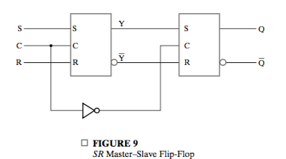
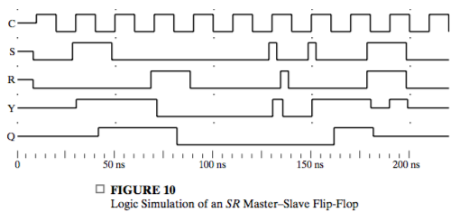
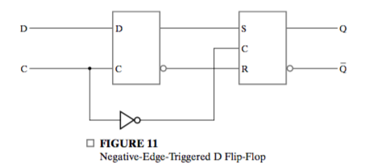
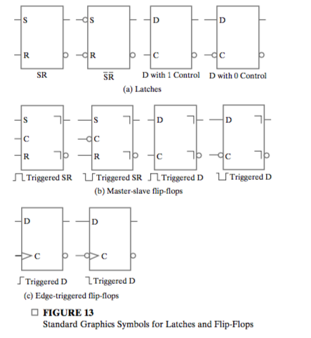
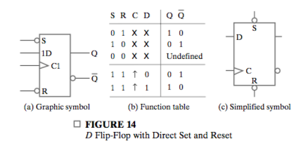
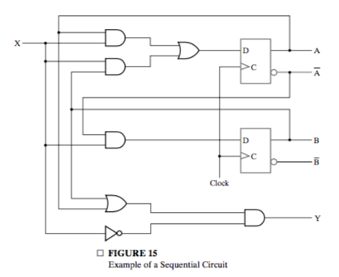

# Chapter 5: Sequential Circuits

## 5-1 Sequential Circuit Definitions

_State_ is the binary information stored in _storage elements_

**Both the next state and the output are a function of the inputs and the present state.**

Two classifications:

* _synchronous sequential circuit_
* _asynchronous sequential circuit_

Synchrounous receives input signals at discrete instants of time.

A closed loop of buffer, or two inverters **with gate delay** $t_G$ can be used to store information. In this case, the duration should be longer than $t_G$. **There must be no inversion of signal over a full loop**.

Synchronon sequanetial circuits that use **clock pulses** generated by a **clock generator** are called **clocked sequential circuits**.

A flip-flop is a binary storage device capable of storing one bit of information. The transition of outputs and state can only change at fixed time intervals.

A flip-flop has one or two inputs. one for the normal value and an optional one for the complemented value.

## 5-2 Latches

The major differences among the various types of latches and flip-flops are 

* The number of inputs they possess and
* The manner in which the inputs affect the binary state.

Latches are the most basic storage elements.

### $SR$ and $\bar{S}\bar{R}$ Latches

$SR$ or $\bar S\bar R$ latches has only two states:

* _set state_: $Q = 1, \bar{Q} = 0$
* _reset state: $Q = 0, \bar{Q} = 1$_

And set state is activated if $S$ or $\bar S$ is activated, in other words, when they equal $1$ and $0$ repectively. **$\bar S$ represent that the set state is active when $\bar S = 0$ **

$SR$ latches are implemented with NOR gates. The following statement is always true

* When $(S, R)$ is $(1, 0)$ or $(0, 1)$, the latch is set to corresponding state. 
* When $(S, R)$ is $(0, 0)$, the state of the latch depends on  its state when either of $S, R$ is $1$
* When $(S, R)$ is $(1, 1)$,  both $Q, \bar Q$ go to $0$. But if then $(S, R)$ goes to $0$, the value of $Q, \bar Q$ are undefined.

You can understand why undefined case may happen: when $(S, R)$ falls from $(1, 1)$ to $(0, 0)$, one of them must change first and causing either state. But whether it's set or reset cannot be determined.

The $\bar S\bar R$ latch consists of two cross-coupled NAND gates.

**A latch with a control input $C$ is like:** 

The inpus are allowed ot affect the state only when $C = 1$. **Note it's very proper to assign "no change" to the table.**

### D Latch

**D latches** eliminate the undesirable undefined state in the $\bar S\bar R​$ latch since $\bar S​$ and $\bar R​$ cannot be $0​$ simutaneously and thus set and reset state cannot be activated at the same time.

The behaviour of it can be described as

* **When $C = 1$, the state of the latch changes with $D$**
* When $C = 0$, the state is determined by the state at the moment $C$ changes from $1$ to $0$, and remains unchanged.

## 5-3 Flip-Flops

The change in value on the control input that allowa the state of a latch in a flip-flop to switch is called a **trigger**. It enables, or **triggers the flip-flop**. 

The D latch with clock pulses on its control input is triggered every time a pulse to the logic-1 level occurs. Then **as long as the pulse remains at the active 1 level, any changes in the data input will change the state of latch.** Such a latch is called **transparent**.

If the output of a transparent latch is connected to the input of the same or other latches, **it will cause unpredictable, constant state changing.**

Flip-flops are design such that **change of value can only happen at one instant.**

### NOTES

A flip-flop has two important property:

* Changing instant: The instant when the state may change. **Note there can only be one instant.**
* Trigger type: **The minimum periodic time duration needed to determine the state at changing time.**

Note the second one means, if we detect the inputs **only at this time durations**, we are able to determine the state of the flip-flop at changing instant. That is, **information at discrete instant/duration is enough for determination of corresponding state at discrete instant or state at any instant.** 

### Master-Slave Flip-Flops

The **master-slave** SR flip-flop consists of two $SR$ latches and inverter. The left clocked latch is called the **master**, and the right the **slave**. We do not use $D$ latches directly to show that some **problems that may appear in such a flip-flop.**

The control input with an inverter guarantees that **only one of the latches is enabled at the same time**. 

When $C$ is $1$, the master is enabled, and it "catches" the input. The slave is disabled, so the **value in the master is not transferrd to the slave.**.

When $C$ is $0$, the master is disabled, and the slave is enabled. At the instant $1$ changes to $0$, **the value in the master is transferred to the slave**, causing the state of the flip-flop to change **only once** . The property of the $SR$ master-slave flip-flop can be summed up as

* The state of the flip-flop changes **ONLY when positive edge occurs **. That is, only at instants the state may change.
* How the state the flip-flop will change depends on the value changes during the last time $C$ is $1$.

The second one is not what we expect, or want. We expect that for an **edge-triggered flip-flop**, the state of certain instant depends only on the input at this instant and the state at the last instant, but not something during this two instant.

For example, if for adjacent two instant,  the original state is reset and both the inputs are $(0, 0)$, from which we may expect that the state remains unchanged. However, if **a short pulse of $S$** happens during the two instant, the slave will **catch the change** and store it, and then transfer it when the next instant comes. This is call the **1s catching.**

The simulation shows 1s catching.

### Edge-Triggered Flip-Flop

We can change the master-slave $SR$ flip-flop, which is a **positive edge triggered flip-flop** into an **negative edge-triggered** flip-flop by simply using the $D$ latch instead.

An **edge-triggered** flip-flop ignores the pulse while it is at a constant level and triggers only during a **transition** of the clock signal. The most important property that distinguish it with the $SR$ latch is that **the state of a $D$ latch depends only on the input at this instant.**

In this flip-flop, $D$ serves as the master, and it ignores the pulse during constant control values. The result is: **we only need to check the inputs at this instant and the state of the last state to determined the state at this instant.**

### Standard Graphics Symbols

Some rules:

* Flip-flops and latches are distinguished by **whether they have an indicator suggesting its triggering type**.
* Positive or negtive pulse/edge triggered type is distinguish by whether ther is a  inverter indicator in front of the $C$ input.
* Pulse or edge triggered type is distinguished by the type of indicator.

**Postponed output indicator** suggests pulse-triggered type. It shows that the output signal changes at the end of the pulse.

**Dynamic indicator** suggests edge-triggered type. It denotes the fact that the flip-flop responds to **edge transitions of the input clock pulses.**

In this text, it is assumed that all flip-flops are of the positive-edge triggered type. 

Note there is not input to the $D$ flip-flop that produces a "no-change" condition. This can be accomplished using a multiplexer or simply disbling the clock pulse.

The technique that disables clock pulses is referred to as _clock gating_. It will cause _clock skew_ since the gated clock pulses into the flip-flops are delayed.

### Direct Inputs

**Direct set**, or **preset** and **direct reset**, or **clear** are special inputs for setting and resetting them **asynchronously**. They have high priority over synchronons inputs.

## 5-4 Sequential Circuit Analysis

A logic diagram is recognized as a **synchronous sequential circuit ** if 

* It includes flip-flops
* with the clock inputs driven directly or indirectly by a clock signal
* and the direct sets and resets are unused during the normal functioning.

### Input Equations

The logic diagram of a sequential circuit can be **FULLY** specified by

* A set of flip-flop input equations, which **specify the time sequence of state shifts **
* A set of output equations

In **flip-flop input euqations**, the inputs to flip-flops are expressed by a Boolean equation **in terms  of the inputs to the circuit and the output of the flip-flops.** We adopt the convention of denoting the dependent variable in the flip-flop input equationby the **flip-flop input symbol with the name of the flip-flop output as the subscript for the variable.**

You can better understand the concept of flip-flop euqations by considering:

* Inputs to flip-flops as **next states**
* Outputs of flip-flops as **present states**

Now you can understand why flip-flop input equations decribe the **next state** in terms of the **inputs** and the **present state**.

$$
\begin {align}
&D_A = AX + BX\\
&D_B = \bar{A}X\\
&Y = (A+B) \bar{X}
\end{align}
$$

### State Table

​			
​		
​	