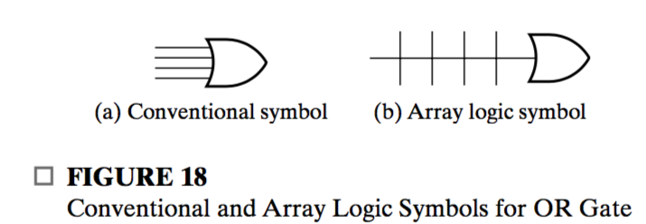
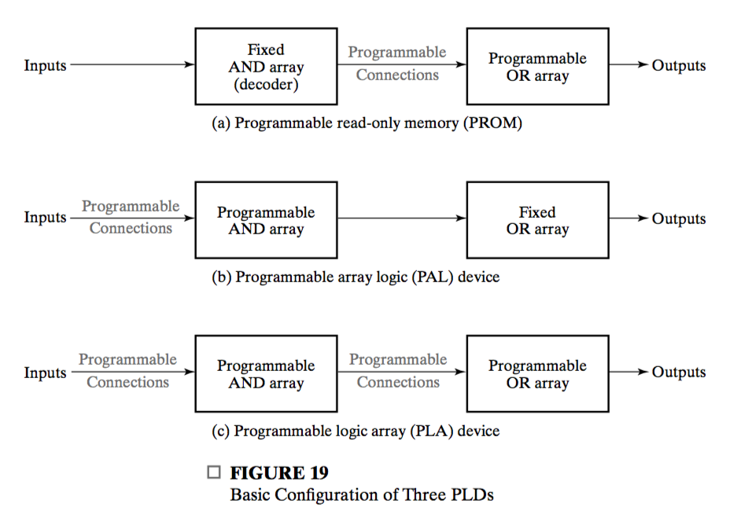
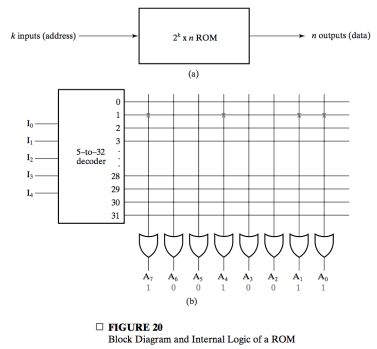

## 6-8 Programmable Implementation Technologies

**Programming** is a hardware procedure that determines which functions are implemented. The next three subsections deal with three types of basic programmable logic devices (**PLD**s): 

* the read-only memory (ROM),
* the programmable logic array (PLA), and 
* the programmable array logic (PAL) device.

Some, but not all, programmable-logic technologies have high fan-in gates. In order to show the internal logic diagram for such technologies in a concise, we use a special gate symbology. Figure 18 shows the conventional and **array logic symbols** for a multiple-input OR gate. If an "x" is present at the intersection of two lines, **there is a connection (Closed)**. If an "x" is not present, then **there is no connection (Open).**

We next consider three distinct programmable device structures. These types of PLDs differ **in the placement of programmable connections in the AND-OR array**.

**Programmable read-only memory (PROM)** as well as flash memory has a **fixed** AND array constructed as a **decoder** and programmable connections for the output OR gates. This forms what appears to be a structure for **implementing sum-of-minterm** equations for the outpus. It also can be thought of as **implementing a truth table**. A truth table, is sure some kind of binary data.

The **programmable array logic** (PAL) device has a **programmable connection AND array** and a **fixed OR array**. The AND gates are programmed to provide the **product terms**, which are logically summed in each OR gate.

The most flexible of the three types of PLD is the **programmable logic array(PLA)**, which has **programmable connections** for **BOTH** AND and OR arrays.

### Read-Only Memory

A **read-only memory (ROM)** is essentially a device in which "permanent" binary information is stored. The information must be **specified by the designer** and is then **embedded** into the ROM to form the required interconnection or electronic device pattern. Once the pattern is established, it stays within the ROM **even when power is turned off** and on again. That is,  ROM is **nonvolatile**.

A block diagram of a ROM is shown in Figure 20. There are $k$ inputs and $n$ outpts. The inputs provide the **address** for the memory, and the outputs give the **data** bits of the stored **word** that is selected by the address. The number of **words** in a ROM device is determined from the fact that $k$ address input lines can specified $2^k$ words. Note that ROM **does not have data inputs**, because it does not have a write operation.

Consider, for example, a $32 \times 8$ ROM. The unit consists of **$32$ words** of **$8$ bits** each. There are **five input lines** that form the address. The five inputs are **decoded** into 32 distinct outputs be means of a **$5$-to-$32$-line decoder**. Each output of the decoder represents a **memory address**. The $32$ outputs are connected through **programmable logic connections** to each of the eight OR gates. Each OR gate has **$32$** inputs. Figure 20(b) is programmed with the word $10010011$ in the memory address $1$. The ROM contains $32\times 8 = 256$ programmable connections. In general, a $2^k\times n$ ROM will have an internal $k$-to$2^k$ line decoder and $n$ OR gates. Each OR gate has $2^k$ inputs, which are connected through **programmable connections** to each of the outpus of the decoder.

Depending on the **programming technology** and approches, read-only memories have different names:

1. ROM—mask programmed
2. PROM—fuse or antifuse programmed
3. EPROM—erasable floating gate programmed
4. EEPROM—electrically erasable floating gate programmed
5. FLASH Memory—electrically erasable floating gate with multiple erasure and programming modes.

