# Chapter 7 Registers and Register Transfers

## 7-1 Registers and Load Enable

A **register** is a set of flip-flops, possibly with added combinationsal gates. The flip-flops hold data, and the gates determine the new and transformed data to be transferred into the flip-flops.

A **counter** is a register that goes through a predetermined sequence of states upon the application of clock pulses. It's common to differentiate them from registers.

Registers and counters are extensively used in the design of digital systems. Registers are useful for **storing and manipulating information**; coutners are employed in circuits that **sequence and control operations** in a digital system.

The simplest register is one that consists of only flip-flops **without external gates**, shown in Figure 7-1. The $Clock$ input triggers all flip-flops synchronously on the positive edge of each pulse. The $\overline{Clear}$ input goes to the $\bar{R}$ inputs of all four flip-flops.

The transfer of new information into a register is referred to as **loading** the register. If all bits are loaded simultaneously, we say the **loading is done in parallel**. For example, a positive clock transition applied to the $Clock$ input of the register of Figure 1(a) **loads all four $D$ inputs into the flip-flops in parallel**.

Figure 1(b) shows a symbol for the register. The **dynamic indicator** represent positive-edge triggering of the flip-flops. The bubble besides $Clear$ input indicates that **application of a logic $0$ to the signal line activates the clear operation**.

### Register with Parallel Load

Recall that regular $D$ flip-flops do not have a "no-change" input condition. To leave the output of a register unchanged regardless of the inputs, we have two choices:

* **Clock gating**
* **$D$ flip-flops with enable**

In clock gating, we simply have the $Clock$ input ORed with a $\overline{Load}$ input to prevent the clock pulses from reaching the register. See Figure 7-1(c). However, inserting gates in the clock pulse path produces different propagation delays between $Clock$ and the inputs of flip-flops **with and without clock gating**, in which **clock skew** is said to exist.

For another choice, we design a new type of $D$ flip-flop, a **$D$ flip-flop with enable**:

Figure 7-2(a) shows the basic implementation. As you can inspect, **the only difference is a $2$-to-$1$ multiplexer, with $EN$ as its selection inputs.** This multiplexer selects the information for the input for the internal $D$ input. The two information it selected from is 

* the external $D$ input
* the internal $Q$ output (present state)

The second is necessary because to remain the state of a $D$ flip-flop unchanged, the only way is to apply its present state to its input.

## 7-2 Register Transfers

It's usually impossible to specify a digital system with state tables. Large digital systems are designed using a mudular hierarchical approach.

In most digital system designs, we partition the system into two types of modules:

* A **datapath**, which performs data-processing operations.
* A **control unit**, which determines the **sequence of those operations**.

To activate a sequence of various data-processing operations, the control unit sends the proper sequence of **control signals** to the datapath. The control unit, in turn, receives status bits from the datapath, which describe aspects of the state of the datapath.

Datapaths are **DEFINED** by their 

* **registers**
* and the **operations** performed on data stored in the registers.

The movement of the data stored in registers and the processing performed on the dsta are referred to as **register transfer operations**. The register transfer operations of digital systems are specified by the following basic components:

1. the set of **registers** in the system
2. the **operations** that are performed on the data stored in the registers, and
3. the **control** that supervises the sequence of operations in the system

That is, to explicitly specify a register transfer operation, you must specify the register the data of which to be operated on, the operations, and the control condition.

An **elementary operation** performed on data stored in registers is called a **microoperation**. The result of the microoperation may replace the previous binary data in the register, or be transferred to another register, **leaving the previous data unchanged**.

The control unit provudes signals that **sequence the microoperations**.

## 7-3 Register Transfer Operations

 We denote the registers in a digital system by uppercase letters (sometimes followed by numerals) that indicates the function of the register. For example, a register that holds an **address for the memory unit** is usually called an **address register** and can be designated by the name $AR$. Other designations for registers are $PC$ for program counter, $IR$ for instruction register, and $R2$ for register 2.

The individul **flip-flops** in a  $n$-bit register are typically nubmered in sequence from $n - 1$ to $0$, starting with $0$ in the least significant bit. This order is referred to as **little-endian**. The reverse order is referred to as **big-endian**.

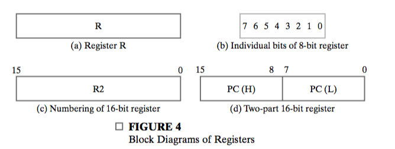

Figure 7-4 shows representations of registers in block-diagram form. Commonly, a register is represented by a rectangular box with the name of the register inside. Note in part (c), a $16$-bit program counter, $PC$ is partitioned into two sections. Bits $0$ through $7$ are assigned the symbol $L$ (for **low-order byte**), and bits $8$ through $15$ are assigned the symbol $H$ (for high-order byte). The label $PC(L)$ may also be written $PC(7:0)$.

**Data transfer** from one register to another is designated in symbolic form by means of the **replacement operator ($\leftarrow$)**. The statement
$$
R2\leftarrow R1
$$
denotes **a transfer of the contents of the register $R1$ into register $R2$.** The register $R1$ is referred to as the **source** of the transfer, and the register $R2$ as the **destination**. **The contents of the source register do not change as a result of the transfer.**

Normally, we want a given transfer to occur not for every clock pulse, but only for **specific values of the control signals.** This can be specified by a **conditional statement**, symbolized by the _if-then_ form 
$$
if (K_1 = 1) then (R2\leftarrow R1)
$$
where $K_1$ is a **control signal** generated in the **control unit**. $K_1$ can be any Boolean function. A more concise notation is
$$
K_1:R2\leftarrow R1
$$

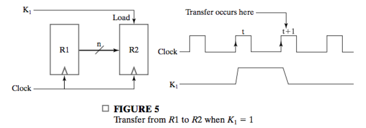

FIgure 7-5 shows a block diagram that depicts the transfer from $R1$ to $R2$. The letter $n$ is used to indicate the number of bit in the register transfer path from $R1$ to $R2$.

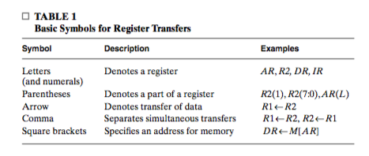

The basic symbols we use in regiter-transfer notation are listed in Table 7-1. Prentheses are used to denote a part of a register by specifying the range of bit in the register or **by giving a symbolic nmae to a portion of the register, e.g., $AR(L)$.**  A comma is used to seperate two or more register transfers that are **executed at the same time.** The statement:
$$
K:R2\leftarrow R1, R1\leftarrow R2
$$
denotes the operation that exchanges the contents of two registers **simultanesously**. Square brackets are used in conjunction with a memory tranfer. $M$ designates a memory word, and the register enclosed inside the brackets provides the **address** of the word in memory.

## 7-5 Microoperations

The microoperations most often encountered in digital systems are of four types:

1. _Transfer_
2. _Arithmetic_
3. _Logic_
4. _Shift_

### Arithmetic Microoperations

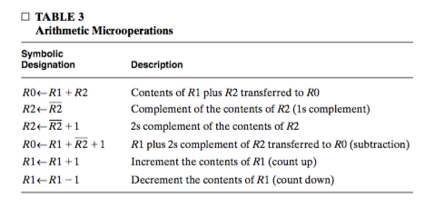

Table 7-3 lists some basic arithmetic microoperations. Note **how subtraction and complementation are represented**.

There is a direct relationship between the statments written in register-transfer notation and the registers and digital functions required for their implementation. For example, to design
$$
\bar{X}K_1: R1 \leftarrow R1 + R2\\
XK_1: R1 \leftarrow R1 + \bar{R2} + 1
$$
Where the control varaible $X$ selects the operation, and the control variable $K_1$ loads the result into $R1$.

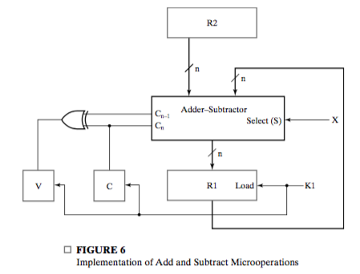

### Logic Microoperations

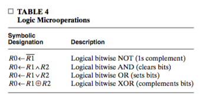

Logic operations consider each bit in the register separately.

The $+$ symbol has two meanings, but can distinguish between them by nting where the symbol occurs. If it occurs **in a microoperation**, it dentoes addition. If it occurs in a **control** or **Boolean function**, it denotes $OR$. For example, in the statement
$$
(K_1 + K_2) : R1\leftarrow R_2 + R3, R4 \leftarrow R5\vee R6
$$

The $+$ between $K_1, K_2$ is an $OR$ operation.

The logic microoperations can change bit values. The $AND$ operation can be used for **clearing** one or more bits in a register to $0$. This operation is called **masking out** the bits, because it **masks** or deltes all $1$s in the **data** in $R1$. The $OR$ microoperation is used to **set** one or more bits in a register. The $XOR$ microoperation can be sued to **complement** one or more bits in a register.

All three microoperations involves a register that serves as a **mask** and another that provides the **data**. Some bits in the data are changed, but others remain unchanged.

### Shift Microoperations

Shift microoperation are used for lateral movement of data. A **left shift** is toward the most significant bit, and a **right shift** is toward the least significant bit.

**The distination register for a shift microoperation may be the same as or different from the source register.** For example
$$
R0 \leftarrow sr\ R0, \quad R1 \leftarrow sl\ R2
$$
For a left-shift microoperation, we call the rightmost bit of the destination register the **incoming bit** and the leftmost bit the **outgoing bit**. We assume that the incoming bit for $sr$ and $sl$ is $0$.

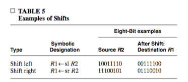

## 7-6 Microoperations on a Single Register

The section covers the implementation of one or moer microoperations with a single regiser as the destination of all primary results. The combinational logic implementing the microoperations is assumed to be part of the register and is called **dedicated logic** of the register. This is in contrast to logic which is shared by multiple destination registers. The combintional logic implementing the microoperations is called **shared logic** for the set of destination registers.

### Multiplexer-Based Transfers

There are occasions when a register receives data from two or more different sources at different times. Consider the following statesments:
$$
K_1: R0\leftarrow R1, \quad \bar{K_1}{K_2}: R0  \leftarrow R2
$$
The important characteristics here is : **$R0$ may receive data from either of two sources, or none.** And whether $R0$ may be loaded, and from which register it is loaded depends on the control input $K_1$ and $K_2$. We can see that

* When $K_1 + \bar{K_1}{K_2}$ is logic $1$, $R0$ will be loaded, no matter from which it is loaded, which **means in this case the $Load$ input for $R0$ should be $1$.**

* When the $Load$ input for $R0$ is correctly handles, the multiplexer should do the following thing:

  * When $K_1$ is logic $1$, transfer the content of $R1$ to $R0$.
  * When $\bar{K_1}K_2$ is $1$, transfer the content of $R2$ to $R0$.

  Because $Load$ is handled correctly, all other conditions are don't-care conditions.

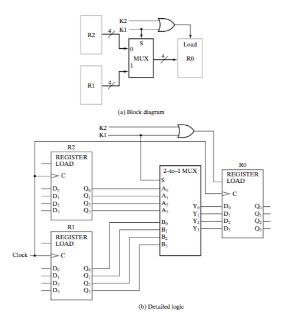

Then we can design the block diagram and the detailed diagram as shown.

This example can be generalized by allowing the multiplexer to have $n$ sources and these sources to be

* Register outputs
* Combinational logic implementing microoperations

In the latter case, the combinational logic can either be dedicated logic or shared logic. This is shown in Figure 7-8

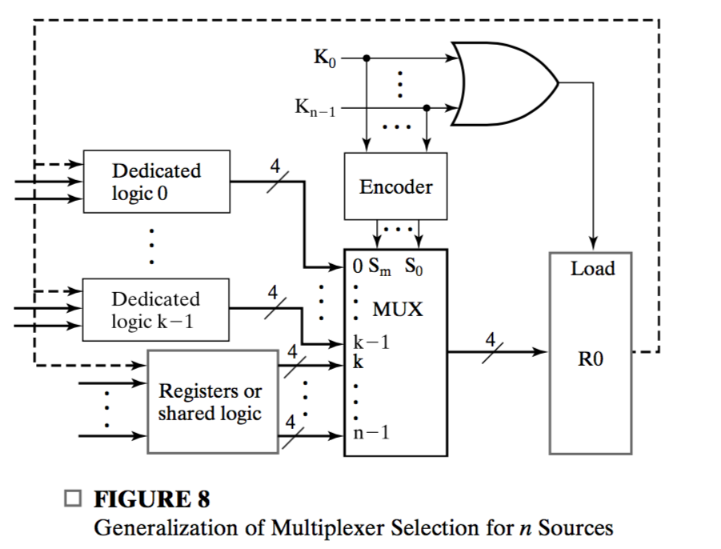

Note in this case, **it is assumed that $K_{n - 1}$ through $K_{0}$ corresponds to one source each**, which mean they will form a one-hot code. In this case, we need an encoder. And all control input are ORed to from the $Load$ input for $R0$.

### Shift Registers

A register capable of shifting its stored bits laterally in one or both directions is called a **shift register**. The simplest possible shift register uses only flip-flops, as shown in Figure 7-9.

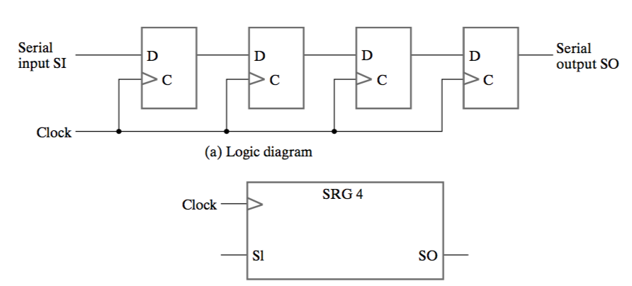

The **serial input $SI$** is the input to the leftmost flip-flop. The **serial output** $SO$ is taken from the output of the rightmost flip-flop.

Sometimes it is necesarry to control the register so that it **shifts only on selected positive clock edges.** This can be done with a $Shift$ input.

#### Shift Register with Parallel Load

If all flip-flop outputs of a shift register are accessible, then information enter **serially** by shifting can be taken out **in parallel** from the flip-flop outputs. If a **parallel load** capability is also added to a shift register, then data entered **in parallel** can be shifted out **serially**. 

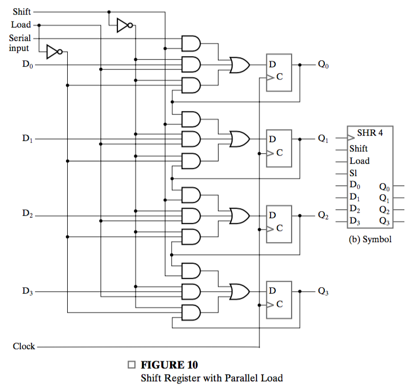

The logic diagram for a $4$-bit **shift register with parallel load** is shown in Figure 7-10.  The operation is specified in Table 6 and is also given by the register transfers:

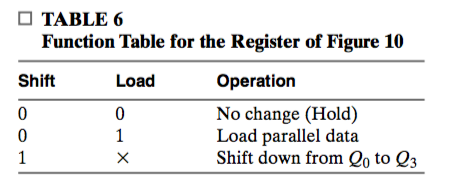
$$
Shift:Q\leftarrow slQ\\
\overline{Shift}\cdot Load:Q\leftarrow D
$$
The "**No change**" operatoin, also called "**Hold**", is implicit.

#### Bidirectional Shift Register

A register capable of shifting in only one direction is called a **unidirectional shift register**. A register that can shift in both directions is a **bidirectional shift register**. Intuitively, this can be done with multiplexers. One stage of a **bidirectional shift register with parallel load** is shown in Figure 7-11. 

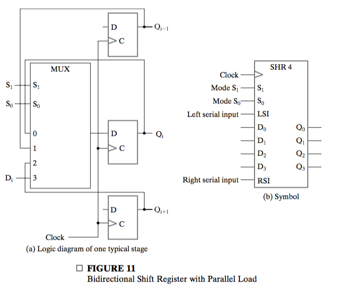

It is vital to note what data the multiplexer select from. For the mulitplexer for flip-flop $i$, the four information input is
$$
0: Q_i\\
1: Q_{i - 1}\\
2: Q_{i + 1}\\
3: D
$$
Which means they perform hold, shift-down, shift-up and parallel load respectively. The selection lines control the mode of operation of the register according to Table 7-7 and the register transfers:
$$
\overline{S_1}S_0: Q\leftarrow slQ\\
S_1\overline{S_0}: Q\leftarrow srQ\\
S_1S_0: Q\leftarrow D
$$
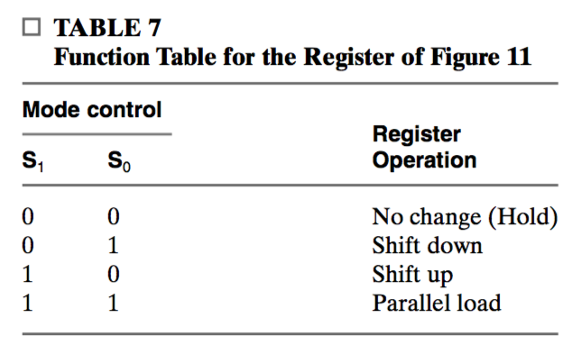

Note that both a **left serial input ($LSI$)** and a **right serial input ($RSI$)** are provided. If serial outputs are desired, **$Q_3$ is used for left shift and $Q_0$ is used for right shift.**

### Ripple Counter

A register that goes through a **prescribed sequence of distinct states** upon the application of a sequence of input pulses is called a **counter**. The input pulses may be

* clock pulses
* some other sources

and they may occur at regular or irregular intervals of time. In our discussion, we assume cock pulses.

The sequence of states may follow 

* the binary number sequence or
* any other prescribed sequence of states

A counter that follows the binary number sequence is called a **binary counter**. An **$n$-bit binary counter** consist of $n$ flip-flops and can count in binary from $0$ through $2^n - 1$.

Counters are available in two categories:

* ripple counters
* synchronous counters

We consider ripple counters first. In a **ripple counter**, **the flip-flop output transitions serve as the sources for triggering the changes in other flip-flops**. In other words, the $C$ inputs of most of the flip-flops are triggered **not by common clock pulse**, which makes it an asynchronous circuit.

The logic diagram of a $4$-bit binary ripple counter is shown in Figure 7-12.

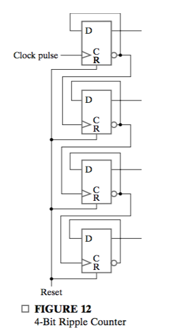

The counter is constructed from $D$ flip-flops connected such that the application of a positive edge to the $C$ input of each flip-flop **causes the flip-flop to complement its state.** The complemented output of each flip-flop is connected to the $C$ input of the next most significant flip-flop. The flip-flop holding the least significant bit receives the incoming clock pulses. The effect is, a transition from $1$ to $0$ in one flip-flop will **cause the flip-flop with higher significant bit complement its state.** The flip-flops change one at a time in quick succession as the signal propagates through the counter in a fipple fashion from one stage to the next.

Downward counting can be accomplished by connecting the true output of each flip-flop to the $C$ input of the next flip-flop.

The advantage of ripple counters is their simple hardware. Unfortunately, they are **asynchonous circuits**. As a consequence, **synchronous binary counters are favored in all but low-power designs, where ripple counters have an advantage.**

### Synchronous Binary Counters

Synchronous counters, in contrast to ripple counters, **have the clock applied to the $C$ inputs of all flip-flops.** A synchronous binary counter that **counts up** by $1$ can be constructed from an **incrementer** and $D$ flip-flops, as shown in Figure 7-13. The incrementer has inputs $A_3, A_2, A_1, A_0$ and output $S_3, S_2, S_1, S_0$, and is formulated as
$$
S_i = A_i \oplus C_i\\
C_{i + 1} = P_iC_i\\
P_i = A_i
$$
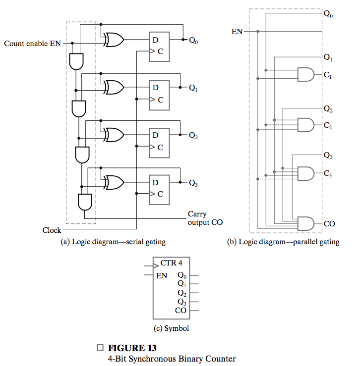

Note by contraction, $G_i$ is not included. Output $CO$ is used to extend the counter to more stages.

#### Serial and Parallel Counters

In Figure 7-13(a), the incrementer is implemented as
$$
S_i = A_i \oplus C_i\\
C_{i + 1} = A_iC_i
$$
This is analogous to the carry logic in the ripple carry adder. A counter that uses such logic is said to have **serial gating** and is referred to as a **serial counter**. The analogy to the ripple carry adder suggests that there might be counter logic analogous to the carry look-ahead adder. Such logic can be derived by a carry look-ahead incrementer shown in Figure 13(b), and this is called **parallel gating**, and the counter is called a **parallel counter.** 

#### Up-Down Counter

A synchronous **count-down binary counter** goes through the binary states in reverse order. The logic diagram of a synchronous count-down binary counter is similar to the circuit for the binary up-counter, except that **a decrementer is used instead of a incrementer**. The decrementer is carried out as
$$
S_i = A_i \oplus \bar{C_i}\\
\overline{C_{i+1}} = \overline{A_i}\cdot\overline{C_i}
$$
A careful examination will show that this can easily be implemented with several multiplexers, if parallel counter is used. We can also add $EN$ input to this counter.

#### Binary Counter with Parallel Load

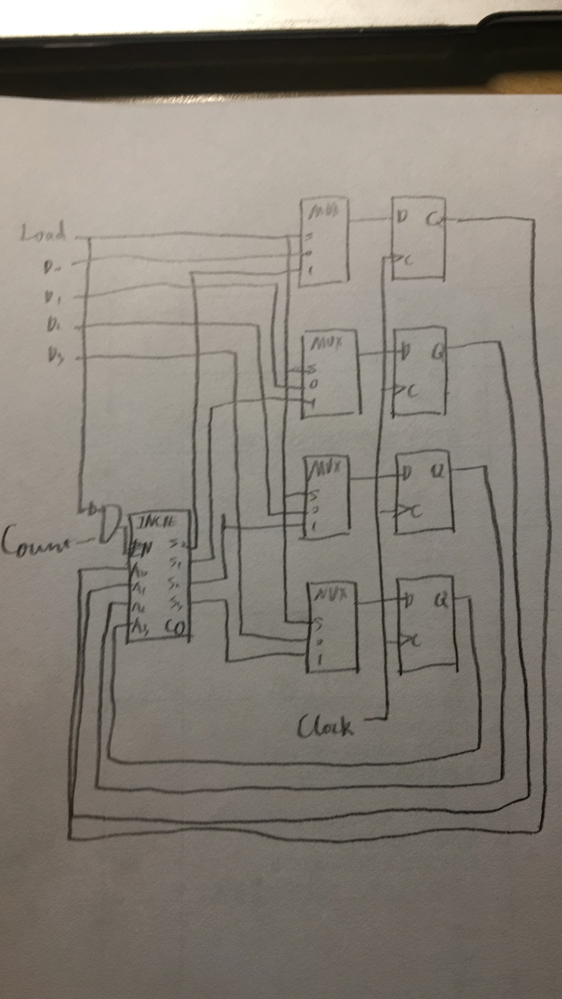

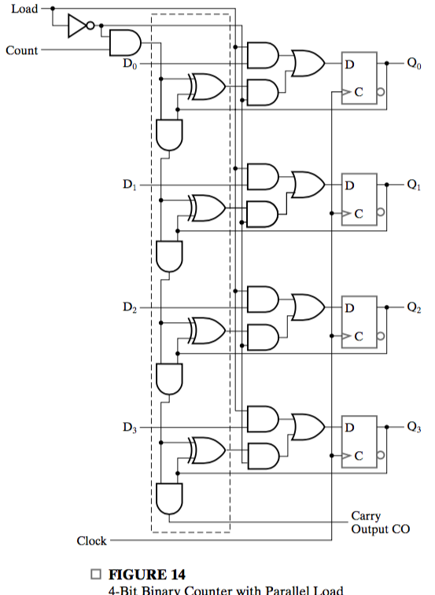

The enable following count is necessary for normal functioning of $CO$. In this configuration, $Load$ overrides $Count$. This is necessary in this following design.

The **binary counter with parallel load can be converted into a synchronous BCD counter (without load input).**

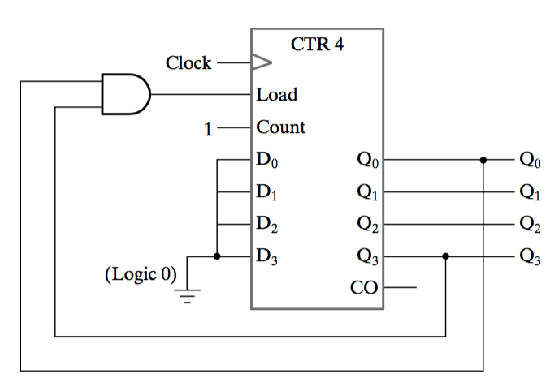

Assume that $\{Q_3, Q_2, Q_1, Q_0\}$ starts with $0000$. Then the counter counts up normally, until it reaches $1001$. In this case, on the next clock transition, the counter does not count, **but is loaded from its four inputs**, which are all all zeros. And the counter start counting again.

### Other Counters

Counters can be designed to generate **any desired number** of states in sequnce. A **divide-by-$N$ counter** (also known as a **modulo-$N$ counter**) is a counter that goes through a repeated sequence of $N$ states. The sequence may follow the binary count or may be any other arbitrary sequence. In either case, the design of the counter follows the procedure for **the common design of synchronou sequential circuits.** 

## 7-7 Register-Cell Design

Refer to the text.

## 7-8 Multiplexer and Bus-Based Transfers For Multiple Registers

A typical digital system has many registers. Paths must be provided to transfer data from one register to another. The amount of logic and the number of interconnections may be excessive if each register has its **own dedicated set of multiplexers.** A **bus** is a shared transfer path. It is characterized by **a set of common lines, with each lines driven by selection logic.** Control signals for the logic select **a single source** and **one or more destinations** on any clock cycle.

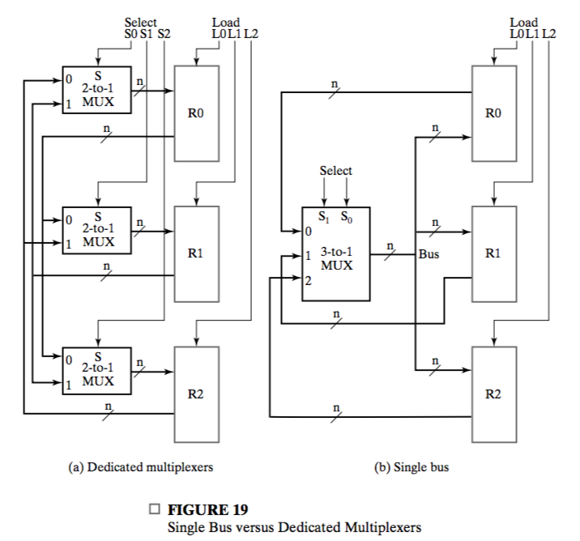

A block diagram for transfers between three registers is shown in Figure 19(a). The same system based on a bus can be implemented by using a **single** $n$-bit $3$-to$1$ multiplexer and parallel load registers.

**If a set of multiplexer outputs is shared as a common path, these output lines are a bus.** The control input set, $Select$, determines the **single** source register that will appear on the bus. The $Load$ inputs determine the **destination registers** to be loaded with the bus data.

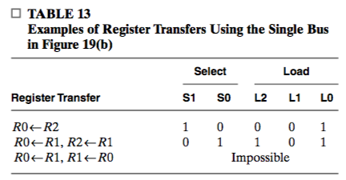

In one clock cycle, **only one set of data** is allowed to appear the data, which results in limitations on simultaneous transfers.

### Three-State Bus

A bus can be constructed with **three-state buffers** instead of multilexers. There are many reasons for doing this, and the most important is the fact that **signals can travel in two directions on a three-state bus**. Thus, the three-state bus can use the same interconnection to carry signals **into and out of a logic circuit.** 

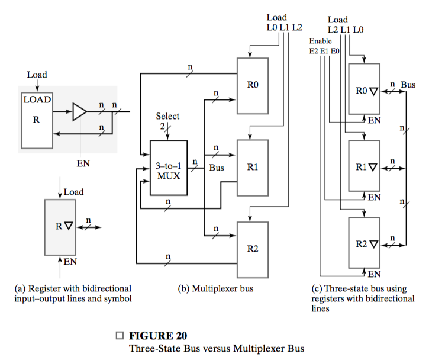

Figure 20(a) shows a register with $n$ lines that serve as **both inputs and outputs** lying across the boundary of the shaded area. If the three-state buffers are enabled, then the lines are **outputs**; if the three-state buffers are disabled, then the lines can be **inputs**. The symbol is also given in the figure.

A multiplexer-implemented bus and a three-state bus are identical **in terms of their register-transfer capability**. The use of such bidirectional input-output lines is particularly effective between logic circuits in different physical packages.

Conceptually, you can regard $EN$ as a selecting signal for the direction of transfer.

## 7-9 Serial Transfer and Microoperations

A digital system is said to **operate in a serial mode** when information in the system is transferred or manipulated one bit at a time. Information is transferred one bit at a time by **shifting the bits out of one register and into a second register.** This process is shown in Figure 7-21.

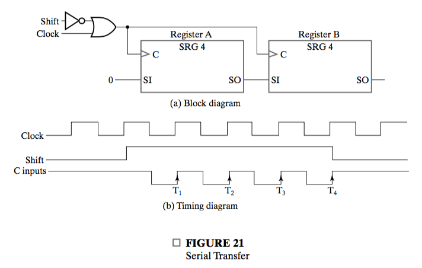

The difference between serial and parallel modes of operation should be clear. In the parallel mode, information is available from **all bits** of a register, and all bits can be transferred **simultaneously** during one clock pulse. In the serial mode, the registers only have a **single serial input** and a **single serial output**, and information is transferred one bit at a time.

### Serial Addition

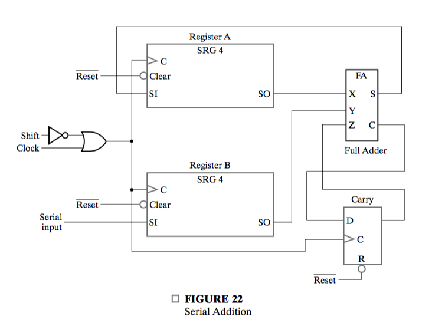

The two binary numbers to be added serially are stored in two shift registers. Bits are added, **one pair at a time**, through a **single** full adder (FA) circuit. The carry out of the full adder is transferred into a $D$ flip-flop.

Serial addition may be repeated to form the addition of two, three, or more numbers, with their sum accumulated in register $A$.

A comparison of the serial adder with the parallel adder provides an example of **space-time trade-off.**

## 7-10 Control of Register Transfers

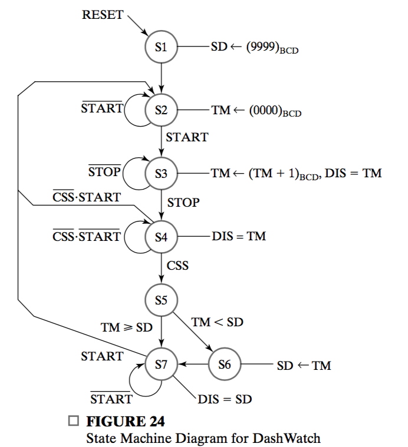

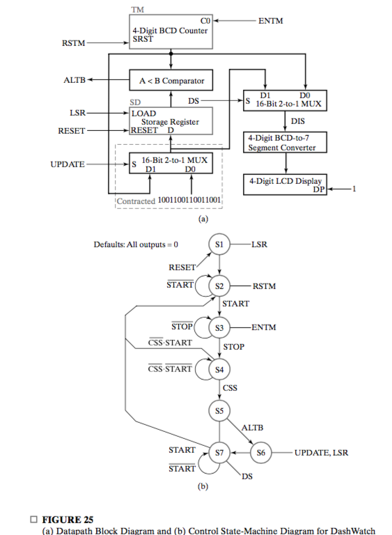

