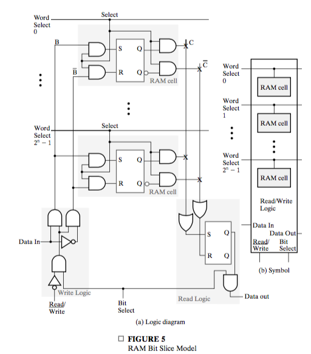
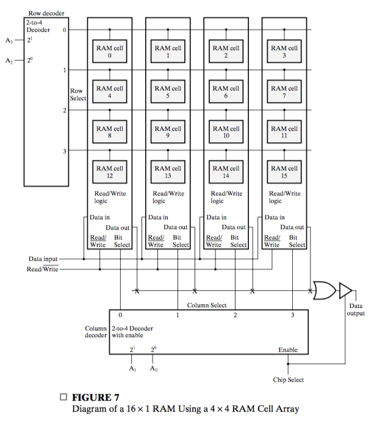
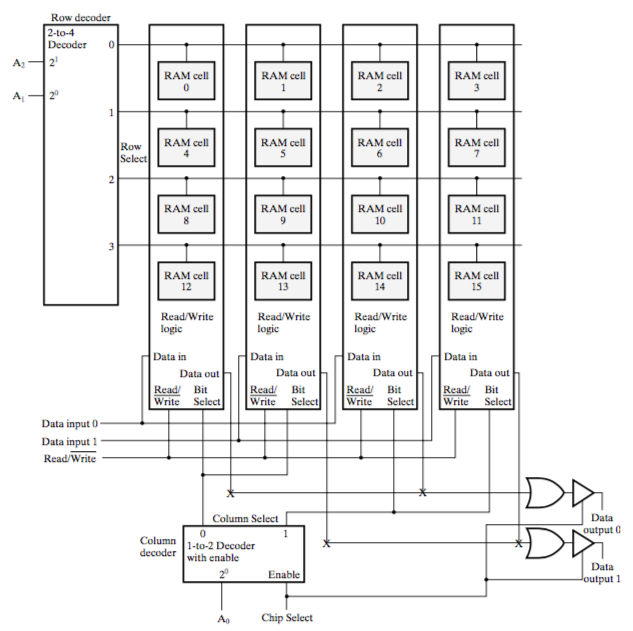

# Chapter 8: Memory Basics

## 8-1 Memory Definitions

In digital systems, **memory** is **a collection of cells capable of storing binary information**. In addition to these cells, memory contatins electronic circuits for **storing and retrieving the information**.

In order for this information to be processed, it is sent from the memory to processing hardware **consisting of registers and combinational logic**. The processed information is then returned to the same or to a different memory.

Two types of memories are used in various parts of a computer: **random-access memory (RAM)** and **read-only memory (ROM)**. The process of storing new information in memory is referred to as a **memory write** operation. The process of transferring the stored information out of memory is referred to as a **memory read** operation. RAM can perform **both** the write and read operations, whereas ROM performs **only** read operations.

## 8-2 Random-Access Memory

Memory is a collection of binary storage cells together with associated circuits needed to transfer information into and out of the cells. Memory cells can be accessed to transfer information to or from **any** desired location, with access **taking the same time regardless of the location**, hence the name **random-access memory**. In contrast, **serial memory**, such as exhibited by a hard drive, takes **different lengths of time** to access information, **depending on where the desired location is** relative to the current physical position of the disk.

Binary information is stored in memory in **groups of bits** and each group of which is called a **word**. A **word** is an entity of bits that **moves in and out of memory as a unit**. 

A group of eight bits is called a **byte**. Most computer memories use words that are **multiples of eight bits in length**. For example, a $16$-bit word contains two bytes. The capacity of a memory unit is usually stated as the total number of bytes it can store.

Communication between a memory and its environment is achieved through **data input** and **output lines**, **address selection lines**, and **control lines** that specify the **direction** of transfer of information. A block diagram is shown in Figure 8-1.

The $n$ **data input lines** provide the information to be stored, and the $n$ **data output lines** supply the data coming out of the memory. The $k$ **address lines** specify the particular **word** chosen. The **Write input** causes binary data to be transferred **into** the memory, and the **Read input** causes binary data to be transferred out of memory.

The memory unit is specified by the **number of words** it contains and the **number of bits** in each words. The **address lines** select one particular **word**. Each word in memory is assigned an identification number called an **address**. Addresses range from $0$ to $2^k - 1$, where $k$ is the number of address lines. A **decoder** accepts this address and opens the paths needed to select the word specified.

Figure 8-2 shows the possible contents of a memory of  a capacity of $1K$ words of $16$ bits each.

### Write and Read Operations

The two operations that a random-access memory can perform are **write** and **read**. A **write** is a transfer into memory of a new **word** to be stored. A **read** is a transfer of a copy of a stored **word** out of memory. A **Write** signal specifies the transfer-in operation and a **Read** signal specifies the transfer-out operation.

The steps that must be taken for a write are as follows:

1. Apply the binary **address** of the desired **word** (recall that every word is assigned an address) to the address lines.
2. Apply the **data bits** that must be stored in memory to the **data input lines**.
3. Activate the **Write** input.

The memory unit will then take the bits from the **data input lines** and store them in the **word specified by the address lines**. 

The steps that must be taken for a read are as follows:

1. Apply the binary **address** of the desired **word** to the address lines.
2. Activate the **Read** input.

The memory will then take the bits from the **word that has been selected by the address** and apply them to the data output lines. The contents of the selected word **are not changed** by reading them.

Memory is made up of **RAM integrated circuits (chips)**, plus additional logic circuits. Instead of having separate Read and Write inputs to control the two operations, must integrated circuits provide at least a **Chip Select** that selects the chip to be read from or written to and a **$Read/\overline{Write}$** that determines the particular operation. The memory operations that result from these control inputs are shown in Table 1.

The $Chip\ Select$ is used to **enable** the particular RAM chip or chips containing the word to be accessed. When $Chip\ Select$ is inactive, **no operation is performed.** When $Chip\ Select$ is active, the $Read/\overline{Write}$ input determines the operation to be performed.

### Timing Waveforms

In essence, memory has no clock inputs. However, it takes time for a memory to read and write.

The operation of the memory unit is controlled by an external device, such as a CPU. The CPU is **synchronized** by its own clock pulses. The memory, however, **does not employ the CPU clock**, since there is no clock input. Instead, its read and write operations are **completely** timed by changes in values on the control inputs.

The **access time** of a memory read operations is the maximum time from the **application of the address** to the **appearance of the data** at the Data Output. Similarly, the **write cycle time** is the maximum time from the **application of the address** to the **completion of all internal memory operations** required to store a word. Memory writes may be performed one after the other at the intervals of the cycle time.

The CPU must provide the memory control signals in such a way as to synchronize its own internal clocked operations with the read and write operations of meory. This means that the **access time** and the **write cycle time** of the memory must be related within the CPU to **a period equal to a fixed number of clock periods**.

Assume that a CPU operates with a clock frequency of 50 MHz, giving a period of 20 ns. Suppose that the CPU communicates with a memory with an access time of 65 ns and a write cycle time of 75 ns. **The number of clock pulses required for a memory request is the integer value greater than or equal to the larger of the access time and the write cycle time, divided by the clock period.** In this case, it will be necessary to devote at least four clock pulses to **each memory request.**

In Figure 8-3, (a) and (b) shows a write opearation and a read operations respectively. Four pulses, $T1, T2, T3, T4$ with a cycle of $20$ ns are shown.

#### Write

* $T1$: the **address** is applied, and Memory Enable is set to the high level.
* $T2$: the data is applied, and the $Read/\overline{Write}$ signal changes to $0$ to designate the write operation. To **avoid destroying data in other memory words**, its is important that this change occurs after the signals on the address lines have become fixed at the desired values. After that, the $Read/\overline{Write}$ signal must stay at $0$ lone enough after application of the address and Memory Enable to allow the write operation to complete.
* $T3$: wait.
* $T4$: wait. At some point between $T4$ and the next $T1$, the write cycle time is reached, and thus $Read/\overline{Write}$ should go to $1$ again. After that, the address and data signals can change. All this should be done before the next $T1$.
* $T1$: you can expect the word has been stored here.

#### Write

* $T1$: the address is applied, and Memory Enable and $Read/\overline{Write}$ are set to $1$.
* $T2$: wait.
* $T3$: wait
* $T4$: wait. At some point between $T4$ and the next $T1$, the data becomes valid, and can be read at the next $T1$.

### Properties of Memory

Integrate-circuit RAM may be either **static** or **dynamic**. **Static RAM (SRAM)** consists of internal **latches** that store the binary information. The stored information remains valid as long as power is applied the RAM. **Dynamic RAM (DRAM)**, stores the binary information in the form of **electric charge s on capacitors.** The stored charge on the capacitors tends to discharge with time, and the capacitors must be periodically reacharged by **refreshing** the DRAM. This is done by cycling through the words every few milliseconds, **reading and rewriting** them to restore the decaying charge.

DRAM offers reduced power consumption and larger storage capacity in a single memory chip, but SRAM is easier to use and has shorter read and write cycles. Also, **no refresh is required for SRAM**.

Memory units that lose stored information when power is turned of  are said to be **volatile**. Integrated-circuit RAMs, both static and dynamic, are of this category. In contrast, a **nonvolatile memory** such as a magnetic disk or ROM, retains its stored information after the removal of power.

## 8-3 SRAM Integrated Circuits

Hierarchy:

* RAM(Memory)
  * RAM chips 
    * RAM bit slices
      * RAM cells
    * additional logic
  * additional logic

As indicated earlier, memory consists of RAM chips plus additional logic. We will consider the internal structure of the RAM chip first. Then we will study combinations of RAM chips and additional logic used to contruct memory.

The **RAM cell** is the basic storage cell used in the **RAM chip**, which is typcically designed as an electronic circuit rather than a logic circuit. Nevertheless, it is possible an convenient to model the RAM chip using a logic model.

Figure 8-4 shows the logic model of the **RAM cell**. The storage part is modeled by an $SR$ latch. **Both** the inputs and outputs are enabled by a Select singal.

To obtain simplified static RAM diagrams, we interconnect a set of RAM cells and **read and write circuits** to form a **RAM bit slice** that contains all of the circuitry associated with a single bit position of **a set of RAM words** (no all words).

The logic diagram for a RAM bit slice is shown in Figure 5(a).

The loading of a latch cell is now controlled by a **Word Select** input. The signal $B$ and $\bar{B}$ is controlled by the Write Logic and Read Logic respectively, with Data in and Data out.

**Only one** Word Select line is $1$ at a time since **only one word is written at a time**. Thus, only one RAM cell attached to $B$ and $\bar{B}$ is written. The Word Select also controls the reading of the RAM cells, using shared Read Logic.

The **Bit Select** controls both the read and write operation.

Let's review the I/O of a RAM bit slice:

* Data In/Out
* Word Select
* Bit Select (global)
* $Read/\overline{Write}$

The symbol for the RAM bit slice is given in Figure 5(b). **Each Word Select line extends beyond the bit slice**, so that when multiple RAM bit slices are placed side by side, corresponding Word Select lines connect.

The symbol and block diagram for a $16\times 1$ RAM chip are shown in Figure 6.

Three hierarchies are involved here:

* RAM
* RAM chip
* RAM slice

There are Data Input, Data Output, and $Read/\overline{Write}$ signals. The Chip Select at the chip level corresponds to the Memory Enable at the level of a RAM consisting of multiple chips.

The internal structure of the RAM chip consists of

* a RAM bit slice having 16 RAM cells
*  a 4-to-16-line decoder
* and a three state buffer that allows contruction of a multiplexer with anarbitrary number of inputs. 

Three-state outputs are connected together and properly controlled using the Chip Select inputs to provide the word from the chip being read to the RAM outpus. To read a word from a particular RAM chip, the Chip Select value for that chip must be $1$, and for all other chips attached to the same output bit lines, the Chip Select must be $0$.

### Coincident Selection

Inside a RAM chip, the decoder with $k$ inputs and $2^k$ outputs requires $2^k$ AND gates with $k$ inputs pergate if a straight forward design approach is used. In addition, if the number of words is large, and **all bits for one bit position in all words** are contained in a single RAM bit slice, the number of RAM cells sharing the read and write circuits is also large.

The total number of decoder gates, the number of inputs per gate, and the number of **RAM cells per bit slice** can all reduced by employing two decoders with a **coincident selection** scheme. In one possible configuration, two $k/2$-input decoders are used instead of one $k$-input decoder. One decoder controls the word selec lines and the other controls the bit select lines. Since the Word Select is no longer strictly selecting words, its name is changed to **Row Select** . An output from the added decoder that selects one or more **bit slices** is referred to as a **Column Select**.

Coincident selection is illustrated for the $16\times 1$ RAM chip with the structure shown in Figure 7. **Note how the RAM cells are numbered**. The two **most significant address inputs** go through the 2-to-4-line **row decoder**. The two **least significant address inputs** go through the 2-to-4-line **column decoder**. The column decoder is enabled with the  Chip Select input. During the read operation, the selected bit of the selected row goes through the OR gate to the three-state buffer. The buffer is enabled by Chip Select.

The same RAM cell array is used in Figure 8 to produce an $8\times 2$ RAM chip. **The row decoding is unchanged** from that in Figure 7. The only changes are in the **column and output logic**. Since there are just three address bits, and two are handled by the row decoder, the column decoder has only one address bit and produces jsut **two column select lines**.  However, there are four columns, so the Column Select lines go to **adjacent pairs of RAM bit slices.** Finally, corresponding bits of the pairs share output OR gates and three-state buffers (**recall that one OR gate combines all bits at one bit position from ALL words**).

## 8-4 Arrays of SRAM ICs

If the memory unit needed for an application is larger than the capcity of **one** chip, it is necessary to combine a number of chips in an array to form the required size of memory. The capacity of the memory depends on two parameters: the number of words and the number of bits per word. An increase in the number of words requires that we **increase the address length**. Every bit added to the length of the address doubles the number of words in memory. An increase in the number of bits per word requires that we **increase the number of data input and output lines**.

 To illustrate an array of **RAM ICs**, let us first introduce a RAM chip using the condensed representation for inputs and outputs shown in Figure 9.

The **capacity** of this chip is 64K words of 8 bits each, which requires a 16-bit address and 8 input and output lines. The **CS (Chip Select)** input selects the particular RAM chip, and the $R/\bar{W}$ input specifies the read or write operation **when the chip is selected**. The small triangle shown at the outputs is the standrad graphics symbol for **three-state outputs.** 

Consider the possibility of constructing a $256K\times 8$ RAM with four $64K\times 8$ RAM chips, as shown in Figure 10.

The data input lines go to all the chips. The three-state outputs can be connected together to form the eight common output lines. **Only one** Chip Select input will be active at any time, while the other three chips will be disabled. The eight outputs of the selected chip will contain 1s and 0s, and the other three will be in a **high-impedance** state.

The 256K-word memory requires an 18-bit address. The 16 least significant bits of the address are applied to the address inputs of **all four chips**. The two most significant bits are appleid to a **2-to-4-line decoder.** The four outputs of the decoder are applied to the **CS inputs** of the four chips. The memory is disabled when the **EN input of the decoder, Memory Enable, is equal to $0$.** When the decoder is enabled, address bits 17 and 16 determine the particular chip that is selected.

It is also possible to combine two chips to form a composite memory containing the **same number of words**, but with twice **as many bits in each word**.

Figure 11 shows the inter connection of two $64K\times 8$ chips to form a $64K\times 16$ memory. The 16 input and data output lines are **split between the two chips**. Both receive **the same 16-bit address and the common CS and $R/\bar{W}$ control inputs.**

The two techniques just described may be combined to assemble an array of identical chips into a large-capacity memory.

To reduce the number of pins on the chip package, many RAM ICs provide **common terminals for the data input and data output**. The common terminals are said to be **bidirectional**. These are consctructed with three-state buffers.

